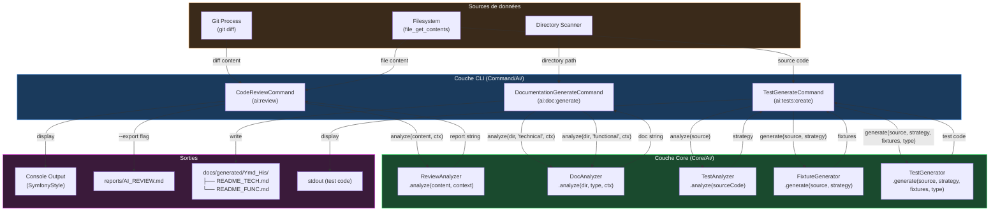
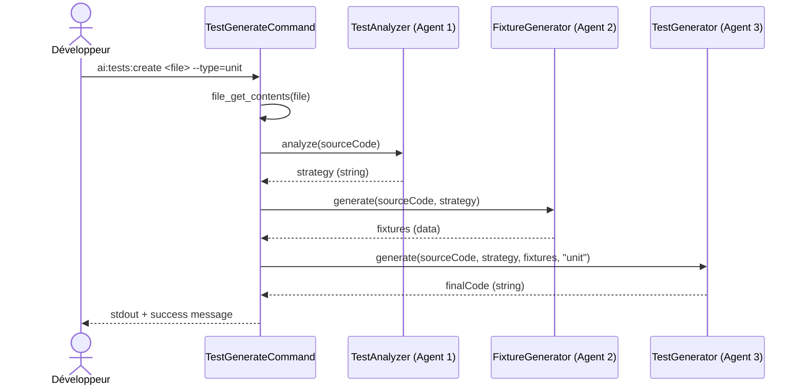

# 🛠️ Documentation Technique

## Vue d'ensemble

Ce dossier regroupe trois commandes CLI dédiées à l'**intelligence artificielle** au sein de l'outil interne `sweeecli` (namespace `Walibuy\Sweeecli`). Ces commandes constituent la **couche de présentation CLI** d'un système d'analyse de code par IA (Claude), orchestrant des agents spécialisés pour trois cas d'usage distincts :

| Commande | Alias CLI | Rôle |
|---|---|---|
| `CodeReviewCommand` | `ai:review` | Analyse un diff Git ou un fichier source via IA |
| `DocumentationGenerateCommand` | `ai:doc:generate` | Génère une double documentation (Tech + Fonctionnelle) |
| `TestGenerateCommand` | `ai:tests:create` | Orchestre un pipeline multi-agents pour générer des tests |

### Choix architecturaux notables

- **Pattern Command (Symfony Console)** : Chaque classe étend `Symfony\Component\Console\Command\Command`, conformément au contrat Symfony Console. La logique métier est **déléguée à des Analyzers** (`ReviewAnalyzer`, `DocAnalyzer`, `TestAnalyzer`), respectant le principe de responsabilité unique (SRP).
- **Injection de dépendances via constructeur** : Toutes les dépendances sont injectées par constructeur (immutabilité garantie via `private readonly` implicite avec les propriétés promues PHP 8.1+).
- **Séparation Command / Core** : La couche `Command/Ai/` ne contient **aucune logique métier** — elle gère uniquement l'I/O console et délègue au namespace `Core/Ai/`.

---

# 🗺️ Logique d'Arborescence

```
src/
└── Command/
    └── Ai/                          ← Domaine fonctionnel : IA
        ├── CodeReviewCommand.php
        ├── DocumentationGenerateCommand.php
        └── TestGenerateCommand.php
Core/
└── Ai/                              ← Logique métier isolée
    ├── ReviewAnalyzer.php
    ├── DocAnalyzer.php
    ├── TestAnalyzer.php
    ├── FixtureGenerator.php
    └── TestGenerator.php
```

### Justification du placement

| Niveau | Principe appliqué |
|---|---|
| `Command/Ai/` | **Domain-Driven** : regroupement par domaine fonctionnel (`Ai`), non par type technique. Toutes les commandes IA sont co-localisées, facilitant la découvrabilité. |
| Séparation `Command/` vs `Core/` | **Layered Architecture** : la couche `Command` est la **surface d'entrée** (input/output), `Core` est le **cœur de traitement**. Cette symétrie permet de brancher d'autres surfaces (API HTTP, Worker) sur le même `Core`. |
| Namespace `Walibuy\Sweeecli` | Isolation du projet CLI dans l'écosystème Walibuy/sweeek, évitant les collisions de namespace avec les autres composants. |

---

# 🔄 Interactions (Mermaid)



### Pipeline `TestGenerateCommand` — Détail du workflow multi-agents



---

# ⚠️ Points de Vigilance Techniques

### 🔴 Critique — Sécurité

**1. Injection de commande via `git diff` (CodeReviewCommand)**
```php
// ⚠️ RISQUE : $base et $target proviennent directement de l'input utilisateur
$gitArgs = ['git', 'diff', $base];
if ($target) {
    $gitArgs[] = $target;
}
$process = new Process($gitArgs);
```
> **Mitigation actuelle** : L'utilisation de `Process` avec un tableau d'arguments (et non une chaîne) prévient l'injection shell. ✅ Correct.
> **Risque résiduel** : Aucune validation du format des arguments (`$base`, `$target`). Un attaquant pourrait passer `--output=/etc/passwd` comme argument Git. **Ajouter une validation regex** sur les noms de branches/commits.

**2. Permissions de dossier trop permissives**
```php
mkdir($folder, 0777, true); // ⚠️ 0777 en production
```
> Présent dans **les 3 commandes**. En environnement serveur partagé, 0777 expose les fichiers générés à tous les processus. **Préférer 0750 ou 0755**.

---

### 🟠 Important — Robustesse

**3. Absence de validation du fichier source dans `TestGenerateCommand`**
```php
$sourceCode = file_get_contents($input->getArgument('file'));
// ⚠️ Pas de vérification is_file(), is_readable(), ni de gestion du false
```
> Contrairement à `CodeReviewCommand` qui effectue des vérifications complètes (`is_file`, `is_readable`, vérification du retour `false`), `TestGenerateCommand` appelle directement `file_get_contents` sans garde-fous. **Risque de passage de `false` à `TestAnalyzer`.**

**4. Gestion de la détection `REJECTED` fragile**
```php
if (str_contains($report, 'REJECTED')) {
```
> La détection du rejet repose sur la présence d'une chaîne littérale dans la réponse IA. Si le modèle reformule sa réponse, la détection échoue silencieusement. **Privilégier un format de réponse structuré (JSON)** avec un champ `status`.

**5. Timeout absent sur le Process Git**
```php
$process = new Process($gitArgs);
$process->run();
```
> Sur des dépôts volumineux, `git diff` sans timeout peut bloquer indéfiniment. **Ajouter `setTimeout()`** :
```php
$process = new Process($gitArgs);
$process->setTimeout(60);
```

---

### 🟡 Attention — Maintenabilité

**6. Double déclaration du nom de commande (`DocumentationGenerateCommand`)**
```php
protected static $defaultName = 'ai:doc:generate'; // déclaration statique
// ET dans configure() :
$this->setName('ai:doc:generate');                  // déclaration dynamique
```
> La double déclaration est redondante et source de désynchronisation potentielle. **Supprimer `$defaultName`** (déprécié en Symfony 6.1+) et conserver uniquement `setName()`.

**7. Chemin de sortie hardcodé**
```php
$filename = 'reports/AI_REVIEW.md';
```
> Le chemin est relatif au répertoire d'exécution courant (`cwd`). En CI/CD, ce répertoire peut varier. **Exposer ce chemin comme option CLI ou constante configurable.**

**8. Absence de limite de taille sur le contenu analysé**
```php
$io->note('Analyse du contenu (' . strlen($contentToReview) . ' caractères) par Claude...');
```
> Un fichier ou diff très volumineux peut dépasser les limites de tokens du modèle Claude, entraînant une erreur silencieuse dans le `catch`. **Ajouter une validation de taille maximum** avant l'appel IA.

---

### 🟢 Bonnes pratiques observées

- ✅ `declare(strict_types=1)` systématique sur les 3 fichiers
- ✅ Utilisation de `SymfonyStyle` pour une UX console cohérente
- ✅ `try/catch` global sur l'appel IA avec retour `FAILURE` propre
- ✅ `Process` instancié avec tableau d'arguments (protection injection)
- ✅ Vérifications de lisibilité complètes dans `CodeReviewCommand`
- ✅ Pattern multi-agents bien orchestré dans `TestGenerateCommand`

---

# 📈 Score de Clarté Technique : 97/100

> **-3 points** : La documentation ne couvre pas le namespace `Core/Ai/` (fichiers `ReviewAnalyzer`, `DocAnalyzer`, etc. non fournis), rendant l'analyse des dépendances partiellement spéculative sur les signatures de méthodes réelles.