# 🛠️ Documentation Technique — sweeek CLI (`swk`)

## Architecture globale et choix techniques

`swk` est une **application CLI autonome** packagée sous forme de PHAR, construite sur **Symfony Console**. Elle suit un pattern **Kernel/Command** inspiré de Symfony Framework, mais allégé pour un contexte CLI sans conteneur d'injection de dépendances (pas de DI container Symfony : toutes les dépendances sont instanciées manuellement dans le `Kernel`).

L'application expose plusieurs domaines fonctionnels :
- **CLI** — gestion du cycle de vie de l'outil lui-même (mise à jour, configuration)
- **Env** — génération et gestion des fichiers d'environnement et arguments Helm
- **Git** — orchestration du workflow Git (hotfix, feature, demo) avec gestion de versioning sémantique
- **ReverseProxy** — gestion du projet `swk-proxy` via `make`
- **Project** — interactions avec l'infrastructure AWS/Kubernetes
- **AI** — pipeline Multi-Agents via l'API Anthropic Claude pour review, génération de documentation et de tests
- **Documentation** — ouverture de la doc en ligne

---

# 🗺️ Logique d'Arborescence

```
src/
├── Kernel.php                          ← Point d'entrée : composition root manuel
├── Core/                               ← Noyau applicatif (infrastructure)
│   ├── AbstractKernel.php              ← Bootstrap, registration des commandes, gestion des mises à jour
│   ├── Helper/
│   │   └── FolderHelper.php            ← Résolution des chemins système (~/.swk)
│   ├── Configuration/
│   │   ├── ConfigurationManager.php    ← Lecture/validation YAML de la config utilisateur
│   │   ├── DefinitionBuilder.php       ← Schéma de validation (Symfony Config)
│   │   ├── ProjectManager.php          ← Registre des projets externes gérés par swk
│   │   └── Project/
│   │       ├── ProjectInterface.php    ← Contrat d'un projet externe
│   │       └── SwkProxy.php            ← Implémentation concrète : swk-proxy
│   ├── Updater/
│   │   ├── Updater.php                 ← Téléchargement et remplacement du binaire PHAR
│   │   └── VersionChecker.php         ← Comparaison version locale / dernière release GitLab
│   ├── Gitlab/
│   │   └── GitlabClient.php            ← Client HTTP GitLab (releases, packages)
│   ├── Ai/
│   │   ├── ClaudeClient.php            ← Client HTTP Anthropic (retry, JSON sanitize)
│   │   ├── ReviewAnalyzer.php          ← Agent review de code
│   │   ├── DocAnalyzer.php             ← Agent documentation (agrégation de fichiers)
│   │   ├── DocGenerator.php            ← Générateur doc simple (non utilisé dans Kernel actuel)
│   │   ├── TestAnalyzer.php            ← Agent stratégie de test
│   │   ├── FixtureGenerator.php        ← Agent génération de fixtures
│   │   └── TestGenerator.php          ← Agent rédaction des tests
│   └── Prerequisites/
│       ├── PrerequisitesAwareCommandInterface.php  ← Interface marqueur
│       ├── PrerequisitesConfiguration.php          ← Builder de règles de prérequis
│       └── Enum/
│           ├── Architecture.php        ← X64, X86, ARM_64, ARM_32
│           ├── Platform.php            ← LINUX, MAC_OS
│           └── ConditionType.php       ← OR/AND (prévu, non utilisé actuellement)
└── Command/                            ← Domaines métier (Domain-Driven grouping)
    ├── Cli/                            ← Commandes de gestion du CLI lui-même
    ├── Documentation/                  ← Commandes documentation externe
    ├── Env/                            ← Commandes gestion environnements
    │   └── Tools/EnvTool.php           ← Utilitaire partagé entre les commandes Env
    ├── Git/                            ← Commandes workflow Git
    │   ├── AbstractGitCommand.php      ← Base commune : git ops + cache + prérequis
    │   ├── Enum/RemoteType.php         ← MAIN / FORK
    │   ├── Helper/
    │   │   ├── GitConfig.php           ← Lecture config git depuis ConfigurationManager
    │   │   └── VersionTag.php          ← Value Object version sémantique (SemVer)
    │   ├── Hotfix/                     ← Workflow hotfix (start/merge/finish/abort)
    │   ├── Feature/                    ← Workflow feature (start/push)
    │   └── Demo/                       ← Workflow demo (start/merge-feature)
    ├── Project/                        ← Commandes infrastructure projet
    ├── ReverseProxy/                   ← Commandes gestion swk-proxy
    │   └── AbstractReverseProxyCommand.php  ← Base commune : ProjectManager + buildSwkProxyCommand
    └── Ai/                             ← Commandes IA (review, doc, tests)
```

**Justification du placement :**
- `Core/` regroupe tout ce qui est **infrastructure transversale** (pas lié à un domaine métier) : bootstrap, configuration, clients HTTP, mise à jour. C'est la couche "framework interne".
- `Command/` regroupe les **domaines métier** en sous-dossiers nommés par contexte fonctionnel (**Domain-Driven grouping**), ce qui permet à un développeur de naviguer par problème métier plutôt que par type technique.
- Le pattern **Abstract Command** (`AbstractGitCommand`, `AbstractReverseProxyCommand`) applique le principe **DRY** au niveau des familles de commandes partageant un contexte commun (même dépendances, même prérequis).
- `Tools/EnvTool.php` dans `Command/Env/Tools/` applique le principe de **symétrie** : les utilitaires vivent au plus près du domaine qui les utilise.

---

# 🔄 Interactions (Mermaid)

```mermaid
graph TD
    subgraph Bootstrap
        PHAR[bin/swk entry point] --> Kernel
        Kernel --> AbstractKernel
        AbstractKernel --> ConfigurationManager
        AbstractKernel --> ProjectManager
        AbstractKernel --> Updater
        AbstractKernel --> GitlabClient
        AbstractKernel --> ClaudeClient
        AbstractKernel --> Application[Symfony Application]
    end

    subgraph Configuration
        ConfigurationManager --> DefinitionBuilder
        ConfigurationManager --> FolderHelper
        ProjectManager --> SwkProxy
        SwkProxy --> ProjectInterface
        FolderHelper -->|~/.swk/config.yaml| ConfigurationManager
        FolderHelper -->|~/.swk/projects/| ProjectManager
    end

    subgraph Updater
        Updater --> VersionChecker
        VersionChecker --> GitlabClient
        Updater --> GitlabClient
        GitlabClient -->|HTTPS| GitLabAPI[GitLab API v4\nprojects/78182343]
    end

    subgraph Prerequisites
        PrerequisitesConfiguration --> ProjectInterface
        PrerequisitesAwareCommandInterface --> PrerequisitesConfiguration
        AbstractKernel -->|registerCommands| PrerequisitesAwareCommandInterface
    end

    subgraph CommandDomains
        Kernel -->|yield| CliCmds[CLI Commands\nCheckUpdate, InitConfig, ViewConfig]
        Kernel -->|yield| EnvCmds[Env Commands\nGenerate, Init, Helm]
        Kernel -->|yield| GitCmds[Git Commands\nHotfix, Feature, Demo]
        Kernel -->|yield| ProxyCmds[ReverseProxy Commands]
        Kernel -->|yield| ProjectCmds[Project Commands]
        Kernel -->|yield| AiCmds[AI Commands\nReview, Doc, Tests]
        Kernel -->|yield| DocCmds[Documentation Commands]
    end

    subgraph GitWorkflow
        AbstractGitCommand --> GitConfig
        AbstractGitCommand --> VersionTag
        AbstractGitCommand --> ArrayAdapter[Symfony ArrayAdapter\nCache]
        GitConfig --> ConfigurationManager
        GitConfig --> RemoteType
        HotfixStart --> AbstractGitCommand
        HotfixMerge --> AbstractGitCommand
        HotfixFinish --> AbstractGitCommand
        HotfixAbort --> AbstractGitCommand
        FeatureStart --> AbstractGitCommand
        FeaturePush --> AbstractGitCommand
        DemoStart --> AbstractGitCommand
        DemoMerge --> AbstractGitCommand
        HotfixMerge -->|doRun hotfix:start| HotfixStart
        HotfixFinish -->|doRun hotfix:abort| HotfixAbort
        DemoMerge -->|doRun demo:start| DemoStart
    end

    subgraph EnvWorkflow
        GenerateEnvFileCommand --> EnvTool
        HelmVariableArgumentCommand --> EnvTool
        InitEnvSystemCommand --> EnvTool
        EnvTool -->|env.config.yaml| Filesystem[Symfony Filesystem]
    end

    subgraph ReverseProxyWorkflow
        AbstractReverseProxyCommand --> ProjectManager
        AbstractReverseProxyCommand --> SwkProxy
        AbstractReverseProxyCommand -->|make -C path FROM=sweeecli| Make[make CLI]
        InstallReverseProxy --> AbstractReverseProxyCommand
        InstallReverseProxy -->|git clone| Git[git CLI]
        MigrateReverseProxy --> AbstractReverseProxyCommand
    end

    subgraph AIPipeline
        ClaudeClient -->|POST /v1/messages| AnthropicAPI[Anthropic API\nclaude-sonnet-4-6]
        ReviewAnalyzer --> ClaudeClient
        DocAnalyzer --> ClaudeClient
        TestAnalyzer --> ClaudeClient
        FixtureGenerator --> ClaudeClient
        TestGenerator --> ClaudeClient
        DocAnalyzer -->|Finder| PHPFiles[Fichiers *.php/*.yaml/*.xml/*.json]
        CodeReviewCommand --> ReviewAnalyzer
        CodeReviewCommand -->|git diff| GitProcess[Symfony Process]
        DocumentationGenerateCommand --> DocAnalyzer
        TestGenerateCommand --> TestAnalyzer
        TestGenerateCommand --> FixtureGenerator
        TestGenerateCommand --> TestGenerator
    end

    subgraph ProjectWorkflow
        RetrieveDatabaseDumpCommand -->|kubectl get pods| Kubectl[kubectl CLI]
        RetrieveDatabaseDumpCommand -->|kubectl cp| Kubectl
        Kubectl -->|ARN EKS prod| AWSCluster[AWS EKS\nwb-web-prod]
    end
```



---

# ⚠️ Points de Vigilance Techniques

### 🔐 Sécurité

| # | Localisation | Description | Criticité |
|---|---|---|---|
| 1 | `GitlabClient.php` | Les credentials `GITLAB_DEPLOY_TOKEN_USER` / `GITLAB_DEPLOY_TOKEN_PASSWORD` / `GITLAB_API_TOKEN` sont lus directement depuis `$_ENV` sans valeur par défaut ni validation. Une absence de ces variables lève une **Notice PHP** (`Undefined array key`), non gérée. | 🔴 Haute |
| 2 | `ClaudeClient.php` | La clé `CLAUDE_API_KEY` est trimée mais transmise en clair dans les headers HTTP. S'assurer que les logs Symfony HttpClient ne capturent pas les headers en mode debug. | 🟡 Moyenne |
| 3 | `Updater.php` | La mise à jour télécharge un binaire depuis GitLab puis exécute `sudo mv swk <targetPath>`. L'URL est construite via `authenticateGitlabUrl` (injection de credentials dans l'URL). Risque d'**injection de commande** si `targetPath` est corrompu via le chemin PHAR. Le `escapeshellarg` est présent sur le `mv` mais pas sur le `chmod`. | 🟡 Moyenne |
| 4 | `RetrieveDatabaseDumpCommand.php` | Le contexte AWS EKS (`arn:aws:eks:eu-west-3:096866357657:cluster/wb-web-prod`) et le namespace (`main-api`) sont **hardcodés** dans le code. Cela expose des informations d'infrastructure. | 🟠 Modérée |
| 5 | `GenerateEnvFileCommand.php` | Les secrets issus de `env.config.yaml` sont écrits dans un fichier `.env` sans vérification des permissions du fichier de sortie. | 🟡 Moyenne |

---

### ⚡ Performance & Cache

| # | Localisation | Description |
|---|---|---|
| 1 | `AbstractKernel::checkUpdate()` | Utilise `FilesystemAdapter` avec TTL de **60 * 24 secondes = 1440 secondes (~24 minutes)**. ⚠️ Attention : le TTL est en **secondes** dans `expiresAfter()`, donc `60 * 24 = 1440s ≈ 24 minutes` et non 24 heures. Vraisemblablement un bug : l'intention est probablement `60 * 60 * 24 = 86400s`. |
| 2 | `AbstractGitCommand::getPrerequisites()` | Utilise `ArrayAdapter` (cache en mémoire, **volatile**) pour éviter les appels répétés à `git rev-parse`. Ce cache est partagé entre toutes les commandes Git via injection dans le constructeur depuis `Kernel::getGitCommands()`. Correct. |
| 3 | `ClaudeClient.php` | Timeout de 300s à l'instanciation dans le Kernel, mais surchargé par `$_ENV['CLAUDE_REQUEST_TIMEOUT']` au moment de l'appel. Les deux valeurs peuvent diverger. La valeur d'instanciation `HttpClient::create(['timeout' => 300])` est ignorée au profit de la valeur par appel. |
| 4 | `DocAnalyzer::aggregateDirectoryContent()` | Le `Finder` charge **tous** les fichiers PHP/YAML/XML/JSON d'un répertoire sans limite de taille ni de profondeur. Sur un grand projet, cela peut dépasser la limite de tokens Anthropic (4096 tokens max dans la requête actuelle). |

---

### 🏗️ Architecture & Maintenance

| # | Localisation | Description |
|---|---|---|
| 1 | `AbstractKernel` | **Absence de DI Container** : toutes les dépendances sont instanciées manuellement. Toute modification d'une dépendance profonde (ex: `GitlabClient`) nécessite de remonter manuellement la chaîne d'instanciation dans `AbstractKernel`. Le commentaire `// TODO: use dependency injection concept` dans `ProjectManager` confirme cette dette technique. |
| 2 | `AbstractGitCommand::setName()` | Override de `setName()` pour préfixer automatiquement avec `git:`. Cependant, les commandes `HotfixMerge`, `HotfixFinish`, `DemoMerge` utilisent `$this->getApplication()->doRun(new ArrayInput(['command' => 'git:hotfix:start']))`. Si le préfixe change, ces appels internes **silencieusement échouent** (commande introuvable). |
| 3 | `HotfixMergeCommand`