# 🛠️ Documentation Technique — `sweeek/sweeecli` (Kernel & Commands)

## Architecture Globale et Choix Techniques

`sweeecli` (alias `swk`) est un **outil CLI PHP** distribué sous forme de PHAR, construit sur **Symfony Console**. Il suit une architecture en couches distinctes :

| Couche | Responsabilité |
|---|---|
| **Kernel** | Point d'entrée, composition des dépendances, enregistrement des commandes |
| **Command** | Logique d'exécution des commandes, organisées par domaine fonctionnel |
| **Core** | Services transverses : configuration, mise à jour, IA, Git, prérequis |

L'outil orchestre plusieurs domaines : gestion Git (hotfix/feature/demo), variables d'environnement Helm, proxy local (`swk-proxy`), IA (Claude Anthropic) et documentation.

---

# 🗺️ Logique d'Arborescence

```
src/
├── Kernel.php                          # Composition root : instancie et câble toutes les dépendances
├── Command/                            # Commandes Symfony Console, regroupées par domaine métier (DDD)
│   ├── Ai/                             # Commandes liées aux fonctionnalités IA (Code Review, Doc, Tests)
│   ├── Cli/                            # Commandes de gestion du CLI lui-même (update, config)
│   ├── Documentation/                  # Commandes d'ouverture de la doc externe
│   ├── Env/                            # Commandes de gestion des variables d'environnement (Helm/YAML)
│   │   └── Tools/EnvTool.php           # Outil partagé pour la manipulation des fichiers .env
│   ├── Git/                            # Commandes Git (hotfix, feature, demo)
│   │   ├── AbstractGitCommand.php      # Commande abstraite : opérations Git bas niveau + cache
│   │   ├── Enum/RemoteType.php         # Enum : MAIN / FORK remote
│   │   ├── Helper/                     # Helpers : VersionTag (SemVer), GitConfig (lecture config)
│   │   ├── Hotfix/                     # Workflow hotfix : Start / Merge / Finish / Abort
│   │   ├── Feature/                    # Workflow feature : Start / Push
│   │   └── Demo/                       # Workflow démo : Start / MergeFeature
│   ├── Project/                        # Commandes projets (récupération dump BDD via kubectl)
│   └── ReverseProxy/                   # Commandes proxy local (install, start, stop, update…)
│       └── AbstractReverseProxyCommand # Commande abstraite proxy : buildSwkProxyCommand()
└── Core/                               # Services transverses, framework interne
    ├── AbstractKernel.php              # Bootstrapping : Application Symfony, services, update check
    ├── Helper/FolderHelper.php         # Chemins système ($HOME, .swk/)
    ├── Ai/                             # Clients et analyzers IA (Claude/Anthropic)
    │   ├── ClaudeClient.php            # Client HTTP Anthropic avec retry
    │   ├── ReviewAnalyzer.php          # Analyse de code review
    │   ├── TestAnalyzer.php            # Stratégie de tests
    │   ├── TestGenerator.php           # Génération du code de test
    │   ├── FixtureGenerator.php        # Génération des fixtures de test
    │   ├── DocAnalyzer.php             # Génération de documentation (tech/fonc)
    │   └── DocGenerator.php           # Génération documentation (legacy/simple)
    ├── Configuration/                  # Gestion de la configuration YAML (~/.swk/config.yaml)
    │   ├── ConfigurationManager.php    # Lecture + validation Symfony Config
    │   ├── DefinitionBuilder.php       # Définition de l'arbre de configuration (TreeBuilder)
    │   ├── ProjectManager.php          # Registre des projets gérés (swk-proxy…)
    │   └── Project/                    # Modèles de projets gérés (SwkProxy, interface)
    ├── Gitlab/GitlabClient.php         # Client HTTP GitLab : releases, tags, packages
    ├── Updater/                        # Logique de mise à jour auto du PHAR
    │   ├── Updater.php                 # Téléchargement et remplacement du binaire
    │   └── VersionChecker.php         # Lecture `.app.version` + comparaison avec GitLab
    └── Prerequisites/                  # Système de garde-fous avant exécution des commandes
        ├── PrerequisitesAwareCommandInterface.php
        ├── PrerequisitesConfiguration.php  # Chaîne de validateurs (plateforme, archi, fichiers, projets)
        └── Enum/                           # Platform, Architecture, ConditionType
```

**Justification du placement :**
- **Domain-Driven** : chaque sous-dossier de `Command/` correspond à un domaine métier isolé (Git, Env, ReverseProxy…).
- **Symétrie** : `Core/Ai/` contient uniquement les services réutilisables (Clients, Analyzers) ; `Command/Ai/` contient uniquement les adaptateurs Console.
- **Composition Root** : `Kernel.php` à la racine de `src/` est le seul endroit où les dépendances concrètes sont instanciées — pas d'injection de conteneur Symfony DI.
- **Abstraction** : `AbstractGitCommand` et `AbstractReverseProxyCommand` centralisent le comportement partagé pour éviter la duplication dans les sous-commandes.

---

# 🔄 Interactions (Mermaid)

```mermaid
graph TD
    subgraph Bootstrap
        PHAR["PHAR Entry Point"] --> K["Kernel extends AbstractKernel"]
        K --> AK["AbstractKernel::__construct()"]
        AK --> CM["ConfigurationManager\n(DefinitionBuilder)"]
        AK --> PM["ProjectManager"]
        AK --> GLC["GitlabClient"]
        AK --> UPD["Updater\n(VersionChecker + GitlabClient)"]
        AK --> CC["ClaudeClient\n(HttpClient + CLAUDE_API_KEY)"]
        AK --> APP["Symfony\\Application"]
    end

    subgraph CommandRegistration
        K --> |"getCommands() yield"| REG["AbstractKernel::registerCommands()"]
        REG --> |"PrerequisitesAwareCommandInterface\n→ checkPrerequisites()"| PC["PrerequisitesConfiguration"]
        PC --> |"platform/arch/project/validators"| PASS{Pass?}
        PASS --> |"Yes"| APP
        PASS --> |"No"| SKIP["Command skipped"]
    end

    subgraph CliCommands["Command/Cli"]
        CHECK["CheckUpdateCommand"] --> UPD
        INITCFG["InitConfigCommand"] --> CM
        VIEWCFG["ViewConfigCommand"] --> CM
    end

    subgraph EnvCommands["Command/Env"]
        GEN["GenerateEnvFileCommand"] --> ET["EnvTool"]
        HELM["HelmVariableArgumentCommand"] --> ET
        INITENV["InitEnvSystemCommand"] --> ET
    end

    subgraph GitCommands["Command/Git"]
        AGC["AbstractGitCommand\n(ArrayAdapter cache)"] --> GC["GitConfig"] --> CM
        HS["HotfixStartCommand"] --> AGC
        HM["HotfixMergeCommand"] --> AGC
        HF["HotfixFinishCommand"] --> AGC
        HA["HotfixAbortCommand"] --> AGC
        FS["FeatureStartCommand"] --> AGC
        FP["FeaturePushCommand"] --> AGC
        DS["DemoStartCommand"] --> AGC
        DMF["DemoMergeFeatureCommand"] --> AGC
        AGC --> VT["VersionTag\n(SemVer helper)"]
    end

    subgraph ProxyCommands["Command/ReverseProxy"]
        ARP["AbstractReverseProxyCommand"] --> PM
        DR["DoctorReverseProxyCommand"] --> ARP
        IR["InstallReverseProxyCommand"] --> ARP
        SR["StartReverseProxyCommand"] --> ARP
        STR["StopReverseProxyCommand"] --> ARP
        UR["UpdateReverseProxyCommand"] --> ARP
        UNIR["UninstallReverseProxyCommand"] --> ARP
        NGR["StartNgrokReverseProxyCommand"] --> ARP
        MR["MigrateReverseProxyCommand"] --> ARP
        PM --> SWP["SwkProxy\n(ProjectInterface)"]
    end

    subgraph AiCommands["Command/Ai"]
        CRC["CodeReviewCommand"] --> RA["ReviewAnalyzer"]
        DGC["DocumentationGenerateCommand"] --> DA["DocAnalyzer"]
        TGC["TestGenerateCommand"] --> TA["TestAnalyzer"]
        TGC --> FG["FixtureGenerator"]
        TGC --> TG["TestGenerator"]
        RA --> CC
        DA --> CC
        TA --> CC
        FG --> CC
        TG --> CC
        CC --> |"POST /v1/messages"| ANT["Anthropic API\n(claude-sonnet-4-6)"]
    end

    subgraph UpdateSystem["Core/Updater"]
        UPD --> VC["VersionChecker"] --> GLC
        UPD --> |"PHAR download + replace"| FS2["Filesystem\n(tar.gz → sudo mv)"]
        GLC --> |"GET /releases"| GITLAB["GitLab API\n(Project 78182343)"]
    end

    K --> CliCommands
    K --> EnvCommands
    K --> GitCommands
    K --> ProxyCommands
    K --> AiCommands
    K --> |"FilesystemAdapter cache\n(update_version, TTL 24h)"| CACHE["~/.swk/cache/"]
```



---

# ⚠️ Points de Vigilance Techniques

### 🔐 Sécurité

| Risque | Localisation | Détail |
|---|---|---|
| **Exposition credentials GitLab** | `GitlabClient::__construct()` | `GITLAB_DEPLOY_TOKEN_USER`, `GITLAB_DEPLOY_TOKEN_PASSWORD`, `GITLAB_API_TOKEN` lus depuis `$_ENV` sans valeur par défaut — une absence lève une `\ErrorException` implicite (accès à une clé manquante dans un tableau). |
| **Clé API dans env** | `AbstractKernel::__construct()` | `CLAUDE_API_KEY` lue via `$_ENV` et `getenv()` en fallback — silencieux si absente (chaîne vide envoyée à l'API). |
| **Injection de commande système** | `Updater::updateToLastVersion()` | `exec('sudo mv swk ' . escapeshellarg($targetPath))` — `escapeshellarg` est présent ✅ mais l'appel `sudo` dans un CLI distribué est un vecteur d'élévation de privilèges si le binaire est compromis. |
| **Credentials dans URL** | `GitlabClient::authenticateGitlabUrl()` | Les credentials deploy token sont injectés en clair dans l'URL HTTP — risque de leak dans les logs HTTP ou historiques shell. |
| **exec() sans capture** | `OpenDocCommand`, `FeaturePushCommand` | Appels `exec('open ...')` sans vérification du code de retour — inoffensif fonctionnellement mais non portable (Windows). |

---

### ⚡ Performance & Cache

| Point | Localisation | Détail |
|---|---|---|
| **Cache ArrayAdapter partagé (Git)** | `Kernel::getGitCommands()` | Une **seule instance** `ArrayAdapter` est créée et injectée dans **toutes** les commandes Git — permet de mutualiser le résultat de `git rev-parse --is-inside-work-tree` dans `getPrerequisites()`. Comportement correct. |
| **Cache FilesystemAdapter (update)** | `AbstractKernel` | TTL de **1 440 secondes** (24 min) pour la vérification de mise à jour — stocké dans `~/.swk/cache/`. Si le cache est corrompu, la vérification échoue silencieusement (`false`). |
| **Timeouts Claude** | `ClaudeClient::call()` | `timeout: 300s`, `max_duration: 900s` par défaut dans `AbstractKernel`, mais **surchargeable** via `CLAUDE_REQUEST_TIMEOUT` / `CLAUDE_MAX_DURATION` — les valeurs 0 ou négatives sont normalisées correctement. |
| **Retry Claude** | `ClaudeClient::call()` | Maximum **2 tentatives** sans délai entre elles — risque de surcharge de l'API Anthropic en cas d'erreur transitoire. Aucun backoff exponentiel. |
| **Lecture fichiers prompts** | Tous les `*Analyzer` / `*Generator` | `file_get_contents()` synchrone sur le filesystem local à chaque appel — pas de cache mémoire des prompts. Pour un CLI interactif c'est acceptable. |

---

### 🏗️ Maintenance & Architecture

| Point | Localisation | Détail |
|---|---|---|
| **Pas de DI Container** | `Kernel.php` + `AbstractKernel.php` | Toutes les dépendances sont instanciées manuellement — cf. le commentaire `// TODO: use dependency injection concept` dans `ProjectManager`. Toute modification d'un constructeur nécessite une mise à jour manuelle dans le Kernel. |
| **Couplage fort kubectl/AWS** | `RetrieveDatabaseDumpCommand` | Le contexte ARN EKS `arn:aws:eks:eu-west-3:096866357657:cluster/wb-web-prod` et le namespace `main-api` sont **hardcodés** — un changement d'infra nécessite une modification du code source et un re-déploiement. |
| **Commandes Git préfixées automatiquement** | `AbstractGitCommand::setName()` | Override de `setName()` qui préfixe `git:` automatiquement — comportement non standard et peu visible, peut surprendre lors de l'ajout de nouvelles commandes. |
| **Commandes de démo non préfixées `git:`** | `DemoStartCommand`, `DemoMergeFeatureCommand` | Ces commandes s'appellent `demo:start` / `demo:merge-feature` mais `DemoMergeFeatureCommand` appelle `git:demo:start` via `doRun()` — incohérence de nommage potentielle si le préfixe change. |
| **`HotfixFinishCommand` invoque d'autres commandes** | `HotfixFinishCommand` | Utilise `$this->getApplication()->doRun()` pour chaîner `hotfix:start` et `hotfix:abort` — couplage fort entre commandes, rend les tests unitaires difficiles sans mock de l'Application. |
| **`DocGenerator` (legacy)** | `Core/Ai/DocGenerator.php` | Cette classe n'est pas injectée dans `Kernel.php` ni utilisée par aucune commande — code mort à supprimer ou documenter. |
| **Permissions fichiers exportés** | `CodeReviewCommand`, `DocumentationGenerateCommand` | `mkdir($folder, 0777, true)` — permissions trop permissives pour un environnement partagé ou CI. |