# 🛠️ Documentation Technique — `sweeek/sweeecli`

## Architecture globale et choix techniques

**sweeecli** (alias `swk`) est une **application CLI PHAR** construite sur le composant `symfony/console`. Elle adopte une architecture **stratifiée** (Layered Architecture) avec une séparation stricte entre :

1. **Le noyau applicatif** (`Core/`) : services partagés, configuration, clients HTTP, système de prérequis
2. **Les commandes** (`Command/`) : logique métier CLI organisée par **domaine fonctionnel** (Git, Env, AI, Proxy, etc.)
3. **Le point d'entrée** (`Kernel.php`) : composition racine (DI manuelle par instanciation directe)

L'application n'utilise **pas de conteneur de services Symfony** (pas de `services.yaml`). La DI est réalisée manuellement dans `Kernel.php` et `AbstractKernel.php` via le pattern **Composition Root**.

---

# 🗺️ Logique d'Arborescence

```
src/
├── Kernel.php                          # Composition Root : instancie et câble toutes les commandes
├── Core/                               # Noyau réutilisable, domaine-agnostique
│   ├── AbstractKernel.php              # Bootstrap applicatif : Application Symfony, services communs
│   ├── Helper/
│   │   └── FolderHelper.php            # Utilitaires de chemins système (~/.swk)
│   ├── Configuration/                  # Gestion de la configuration globale du CLI
│   │   ├── ConfigurationManager.php    # Lecture/validation YAML via Symfony Config
│   │   ├── DefinitionBuilder.php       # Schéma de configuration (TreeBuilder)
│   │   ├── ProjectManager.php          # Registre des projets sous-jacents (swk-proxy, etc.)
│   │   └── Project/
│   │       ├── ProjectInterface.php    # Contrat pour tout projet managé
│   │       └── SwkProxy.php            # Implémentation : projet swk-proxy
│   ├── Updater/                        # Mise à jour du binaire PHAR
│   │   ├── Updater.php                 # Orchestration : téléchargement + remplacement du PHAR
│   │   └── VersionChecker.php          # Lecture de .app.version + comparaison via GitLab API
│   ├── Gitlab/
│   │   └── GitlabClient.php            # Client HTTP GitLab (releases, packages, auth deploy token)
│   ├── Ai/                             # Couche d'intégration LLM (Anthropic Claude)
│   │   ├── ClaudeClient.php            # Client HTTP Claude (retry, normalisation JSON, timeouts)
│   │   ├── ReviewAnalyzer.php          # Agent : analyse de diff/fichier → rapport de qualité
│   │   ├── TestAnalyzer.php            # Agent : stratégie de test
│   │   ├── FixtureGenerator.php        # Agent : génération de fixtures
│   │   ├── TestGenerator.php           # Agent : rédaction du code de test
│   │   ├── DocAnalyzer.php             # Agent : documentation technique/fonctionnelle
│   │   └── DocGenerator.php            # Agent simple (doc à partir de source brut) [⚠️ non utilisé]
│   └── Prerequisites/                  # Système de garde-fous avant exécution d'une commande
│       ├── PrerequisitesAwareCommandInterface.php
│       ├── PrerequisitesConfiguration.php   # Fluent builder : plateforme, archi, projets, validators
│       └── Enum/
│           ├── Platform.php
│           ├── Architecture.php
│           └── ConditionType.php            # [⚠️ déclaré mais non utilisé dans PrerequisitesConfiguration]
└── Command/                             # Commandes CLI, organisées par domaine (Domain-Driven naming)
    ├── Cli/                             # Commandes d'auto-gestion du CLI lui-même
    │   ├── CheckUpdateCommand.php
    │   ├── InitConfigCommand.php
    │   └── ViewConfigCommand.php
    ├── Documentation/
    │   └── OpenDocCommand.php
    ├── Env/                             # Gestion des variables d'environnement multi-apps (helm, .env)
    │   ├── GenerateEnvFileCommand.php
    │   ├── HelmVariableArgumentCommand.php
    │   ├── InitEnvSystemCommand.php
    │   └── Tools/
    │       └── EnvTool.php              # Helper : manipulation des noms de variables avec mapping
    ├── Git/                             # Workflow Git structuré (hotfix, feature, demo)
    │   ├── AbstractGitCommand.php       # Base commune : git operations + cache ArrayAdapter
    │   ├── Enum/
    │   │   └── RemoteType.php           # MAIN | FORK
    │   ├── Helper/
    │   │   ├── GitConfig.php            # Lecture de la config git (remotes)
    │   │   └── VersionTag.php           # Parsing/manipulation sémantique X.Y.Z
    │   ├── Hotfix/                      # Cycle de vie hotfix (start→merge→finish→abort)
    │   ├── Feature/                     # Cycle de vie feature (start→push)
    │   └── Demo/                        # Cycle de vie demo (start→merge-feature)
    ├── Project/
    │   └── RetrieveDatabaseDumpCommand.php  # kubectl cp depuis un pod EKS AWS
    ├── ReverseProxy/                    # Gestion du projet swk-proxy (docker-compose via make)
    │   ├── AbstractReverseProxyCommand.php  # Base : buildSwkProxyCommand() → make -C ...
    │   ├── InstallReverseProxyCommand.php
    │   ├── MigrateReverseProxyCommand.php
    │   ├── StartReverseProxyCommand.php
    │   ├── StartNgrokReverseProxyCommand.php
    │   ├── StopReverseProxyCommand.php
    │   ├── UpdateReverseProxyCommand.php
    │   ├── UninstallReverseProxyCommand.php
    │   └── DoctorReverseProxyCommand.php
    └── Ai/                              # Commandes CLI exposant les agents IA
        ├── CodeReviewCommand.php
        ├── DocumentationGenerateCommand.php
        └── TestGenerateCommand.php
```

**Pourquoi cette structure ?**

| Principe | Application concrète |
|---|---|
| **Domain-Driven Naming** | `Command/Git/Hotfix/`, `Command/Env/`, `Command/Ai/` = un dossier par domaine métier |
| **Separation of Concerns** | `Core/` ne dépend jamais de `Command/` ; flux unidirectionnel |
| **Composition Root unique** | `Kernel.php` est le seul endroit où les dépendances sont assemblées |
| **Testabilité** | Chaque `Core/Ai/*Analyzer` est instanciable indépendamment (pas de couplage statique) |

---

# 🔄 Interactions (Mermaid)

```mermaid
flowchart TD
    subgraph Bootstrap["Bootstrap (bin/swk)"]
        ENTRY["bin/swk (entrypoint)"]
        KERNEL["Kernel extends AbstractKernel"]
        ABSTRACT_KERNEL["AbstractKernel\n(initialize + run)"]
    end

    subgraph CoreServices["Core Services"]
        CONFIG_MGR["ConfigurationManager\n(YAML + TreeBuilder)"]
        DEF_BUILDER["DefinitionBuilder\n(Symfony Config TreeBuilder)"]
        PROJECT_MGR["ProjectManager\n(registre projets)"]
        UPDATER["Updater\n(téléchargement PHAR)"]
        VERSION_CHECKER["VersionChecker\n(.app.version)"]
        GITLAB_CLIENT["GitlabClient\n(API GitLab + deploy token)"]
        FILESYSTEM_CACHE["FilesystemAdapter\n(cache mise à jour 24h)"]
        CLAUDE_CLIENT["ClaudeClient\n(API Anthropic + retry)"]
        FOLDER_HELPER["FolderHelper\n(~/.swk)"]
    end

    subgraph Prerequisites["Système Prérequis"]
        PREREQ_CONF["PrerequisitesConfiguration\n(fluent builder)"]
        PREREQ_IFACE["PrerequisitesAwareCommandInterface"]
    end

    subgraph CommandsCli["Commands: CLI"]
        CHECK_UPDATE["cli:check-update"]
        INIT_CONFIG["cli:config:init"]
        VIEW_CONFIG["cli:config:view"]
    end

    subgraph CommandsEnv["Commands: Env"]
        GEN_ENV["env:export:file"]
        INIT_ENV["env:init"]
        HELM_ARGS["env:helm:arguments"]
        ENV_TOOL["EnvTool\n(helper mapping variables)"]
    end

    subgraph CommandsGit["Commands: Git"]
        ABSTRACT_GIT["AbstractGitCommand\n(git operations + ArrayAdapter cache)"]
        GIT_CONFIG["GitConfig\n(remotes depuis ConfigManager)"]
        VERSION_TAG["VersionTag\n(semver X.Y.Z)"]
        HOTFIX_START["hotfix:start"]
        HOTFIX_MERGE["hotfix:merge"]
        HOTFIX_FINISH["hotfix:finish"]
        HOTFIX_ABORT["hotfix:abort"]
        FEATURE_START["feature:start"]
        FEATURE_PUSH["feature:push"]
        DEMO_START["demo:start"]
        DEMO_MERGE["demo:merge-feature"]
    end

    subgraph CommandsProxy["Commands: ReverseProxy"]
        ABSTRACT_PROXY["AbstractReverseProxyCommand\n(make -C <projectPath> ...)"]
        PROXY_INSTALL["proxy:install"]
        PROXY_MIGRATE["proxy:migrate"]
        PROXY_START["proxy:start"]
        PROXY_STOP["proxy:stop"]
        PROXY_UPDATE["proxy:update"]
        PROXY_UNINSTALL["proxy:uninstall"]
        PROXY_DOCTOR["proxy:doctor"]
        PROXY_NGROK["proxy:start:ngrok"]
        SWK_PROXY["SwkProxy\n(ProjectInterface)"]
    end

    subgraph CommandsAi["Commands: AI"]
        CODE_REVIEW["ai:review"]
        DOC_GENERATE["ai:doc:generate"]
        TEST_GENERATE["ai:tests:create"]
        REVIEW_ANALYZER["ReviewAnalyzer"]
        DOC_ANALYZER["DocAnalyzer\n(Finder + prompts)"]
        TEST_ANALYZER["TestAnalyzer"]
        FIXTURE_GEN["FixtureGenerator"]
        TEST_GEN["TestGenerator"]
    end

    subgraph CommandsProject["Commands: Project"]
        DB_DUMP["project:database:retrieve-dump\n(kubectl cp)"]
    end

    subgraph CommandsDoc["Commands: Documentation"]
        OPEN_DOC["documentation:open"]
    end

    %% Bootstrap
    ENTRY --> KERNEL
    KERNEL --> ABSTRACT_KERNEL

    %% Core wiring
    ABSTRACT_KERNEL --> CONFIG_MGR
    ABSTRACT_KERNEL --> PROJECT_MGR
    ABSTRACT_KERNEL --> UPDATER
    ABSTRACT_KERNEL --> FILESYSTEM_CACHE
    ABSTRACT_KERNEL --> CLAUDE_CLIENT
    CONFIG_MGR --> DEF_BUILDER
    CONFIG_MGR --> FOLDER_HELPER
    PROJECT_MGR --> FOLDER_HELPER
    PROJECT_MGR --> SWK_PROXY
    UPDATER --> VERSION_CHECKER
    UPDATER --> GITLAB_CLIENT
    VERSION_CHECKER --> GITLAB_CLIENT

    %% Kernel → Commands
    KERNEL --> CHECK_UPDATE
    KERNEL --> INIT_CONFIG
    KERNEL --> VIEW_CONFIG
    KERNEL --> GEN_ENV
    KERNEL --> INIT_ENV
    KERNEL --> HELM_ARGS
    KERNEL --> HOTFIX_START
    KERNEL --> HOTFIX_MERGE
    KERNEL --> HOTFIX_FINISH
    KERNEL --> HOTFIX_ABORT
    KERNEL --> FEATURE_START
    KERNEL --> FEATURE_PUSH
    KERNEL --> DEMO_START
    KERNEL --> DEMO_MERGE
    KERNEL --> ABSTRACT_PROXY
    KERNEL --> CODE_REVIEW
    KERNEL --> DOC_GENERATE
    KERNEL --> TEST_GENERATE
    KERNEL --> DB_DUMP
    KERNEL --> OPEN_DOC

    %% CLI Commands
    CHECK_UPDATE --> UPDATER
    INIT_CONFIG --> CONFIG_MGR
    VIEW_CONFIG --> CONFIG_MGR

    %% Env Commands
    GEN_ENV --> ENV_TOOL
    HELM_ARGS --> ENV_TOOL

    %% Git Commands
    ABSTRACT_GIT --> GIT_CONFIG
    ABSTRACT_GIT --> VERSION_TAG
    GIT_CONFIG --> CONFIG_MGR
    HOTFIX_START --> ABSTRACT_GIT
    HOTFIX_MERGE --> ABSTRACT_GIT
    HOTFIX_FINISH --> ABSTRACT_GIT
    HOTFIX_ABORT --> ABSTRACT_GIT
    FEATURE_START --> ABSTRACT_GIT
    FEATURE_PUSH --> ABSTRACT_GIT
    DEMO_START --> ABSTRACT_GIT
    DEMO_MERGE --> ABSTRACT_GIT

    %% Proxy Commands
    ABSTRACT_PROXY --> PROJECT_MGR
    PROXY_INSTALL --> ABSTRACT_PROXY
    PROXY_MIGRATE --> ABSTRACT_PROXY
    PROXY_START --> ABSTRACT_PROXY
    PROXY_STOP --> ABSTRACT_PROXY
    PROXY_UPDATE --> ABSTRACT_PROXY
    PROXY_UNINSTALL --> ABSTRACT_PROXY
    PROXY_DOCTOR --> ABSTRACT_PROXY
    PROXY_NGROK --> ABSTRACT_PROXY

    %% AI Commands
    CODE_REVIEW --> REVIEW_ANALYZER
    DOC_GENERATE --> DOC_ANALYZER
    TEST_GENERATE --> TEST_ANALYZER
    TEST_GENERATE --> FIXTURE_GEN
    TEST_GENERATE --> TEST_GEN
    REVIEW_ANALYZER --> CLAUDE_CLIENT
    DOC_ANALYZER --> CLAUDE_CLIENT
    TEST_ANALYZER --> CLAUDE_CLIENT
    FIXTURE_GEN --> CLAUDE_CLIENT
    TEST_GEN --> CLAUDE_CLIENT

    %% Prerequisites
    ABSTRACT_GIT -.->|implements| PREREQ_IFACE
    ABSTRACT_PROXY -.->|implements| PREREQ_IFACE
    PREREQ_IFACE --> PREREQ_CONF
    ABSTRACT_KERNEL -->|filtre commandes| PREREQ_CONF
```



---

# ⚠️ Points de Vigilance Techniques

## 🔴 Critique — Sécurité

### 1. Credentials en dur dans `GitlabClient.php`
```php
// ProjectManager.php — ID de projet GitLab hardcodé
'https://gitlab.com/api/v4/projects/78182343/releases'
```
L'ID de projet `78182343` est codé en dur. Si le projet est renommé ou migré, le binaire entier cesse de se mettre à jour sans recompilation.

### 2. Exposition de la clé Claude via variable d'environnement non protégée
```php
$_ENV['CLAUDE_API_KEY'] ?? getenv('CLAUDE_API_KEY') ?? ''
```
Aucune validation de format ou alerte si la clé est vide. Un appel silencieux échouera avec une erreur 401 non explicite côté utilisateur.

### 3. `exec()` sans échapp