# 🛠️ Documentation Technique

## Vue d'ensemble

Ce dossier regroupe trois commandes CLI propulsées par l'IA au sein de l'outil interne **Sweeecli** (`walibuy/sweeecli`). Ces commandes s'inscrivent dans une architecture **Domain-Driven** où chaque commande délègue la logique métier à des services spécialisés du domaine `Core\Ai`. Elles constituent la **couche de présentation CLI** (entrée utilisateur, affichage, gestion des erreurs) et ne contiennent aucune logique d'analyse directe.

### Commandes exposées

| Commande | Classe | Rôle |
|---|---|---|
| `ai:review` | `CodeReviewCommand` | Analyse un diff Git ou un fichier via l'IA et produit un rapport de qualité |
| `ai:doc:generate` | `DocumentationGenerateCommand` | Génère une double documentation (technique + fonctionnelle) d'un dossier |
| `ai:tests:create` | `TestGenerateCommand` | Orchestre un pipeline multi-agents pour générer des tests unitaires/fonctionnels |

---

# 🗺️ Logique d'Arborescence

```
src/
└── Command/
    └── Ai/          ← Namespace: Walibuy\Sweeecli\Command\Ai
        ├── CodeReviewCommand.php
        ├── DocumentationGenerateCommand.php
        └── TestGenerateCommand.php
```

### Justification du placement

**`Command/`** : Respecte la convention Symfony Console. Toutes les classes héritant de `Symfony\Component\Console\Command\Command` sont regroupées ici. C'est la **couche d'entrée** (Input/Output layer) de l'application CLI.

**`Command/Ai/`** : Sous-domaine fonctionnel dédié aux fonctionnalités IA. Ce regroupement suit le principe **Domain-Driven Design (DDD)** en isolant les commandes IA des autres domaines CLI potentiels (ex: `Command/Git/`, `Command/Deploy/`). La symétrie structurelle est respectée : chaque commande `Command\Ai\XxxCommand` consomme un service `Core\Ai\XxxAnalyzer`, reflétant une organisation en miroir entre la couche présentation et la couche domaine.

**Convention de nommage** : Le suffixe `Command` est obligatoire par convention Symfony pour les classes enregistrées comme commandes Symfony Console.

---

# 🔄 Interactions (Mermaid)

```mermaid
graph TD
    subgraph CLI["Couche Présentation : Command/Ai/"]
        CRC["CodeReviewCommand\nai:review"]
        DGC["DocumentationGenerateCommand\nai:doc:generate"]
        TGC["TestGenerateCommand\nai:tests:create"]
    end

    subgraph CORE["Couche Domaine : Core/Ai/"]
        RA["ReviewAnalyzer\n#analyze(content, context)"]
        DA["DocAnalyzer\n#analyze(dir, type, ctx, format)"]
        TA["TestAnalyzer\n#analyze(sourceCode)"]
        FG["FixtureGenerator\n#generate(sourceCode, strategy)"]
        TG["TestGenerator\n#generate(sourceCode, strategy, fixtures, type)"]
    end

    subgraph EXT["Dépendances Externes"]
        GIT["Process (symfony/process)\ngit diff"]
        FS["Filesystem\nfile_get_contents / file_put_contents"]
        AI["API IA (Claude)\nAnthropique"]
    end

    subgraph OUT["Sorties"]
        RPT["reports/AI_REVIEW.md"]
        DOC_T["docs/generated/YmdHis/README_TECH.{md,json}"]
        DOC_F["docs/generated/YmdHis/README_FUNC.{md,json}"]
        TESTS["stdout (code de test)"]
    end

    CRC -->|"injecte"| RA
    DGC -->|"injecte"| DA
    TGC -->|"injecte"| TA
    TGC -->|"injecte"| FG
    TGC -->|"injecte"| TG

    CRC -->|"exécute"| GIT
    CRC -->|"lit fichier"| FS
    DGC -->|"lit dossier"| FS
    TGC -->|"lit fichier"| FS

    RA -->|"appel HTTP"| AI
    DA -->|"appel HTTP"| AI
    TA -->|"appel HTTP"| AI
    FG -->|"appel HTTP"| AI
    TG -->|"appel HTTP"| AI

    CRC -->|"--export"| RPT
    DGC -->|"écrit"| DOC_T
    DGC -->|"écrit"| DOC_F
    TGC -->|"affiche"| TESTS

    subgraph PIPELINE["Pipeline Multi-Agents (TestGenerateCommand)"]
        direction LR
        STEP1["Agent 1\nTestAnalyzer\n(Stratégie)"] -->|"strategy"| STEP2["Agent 2\nFixtureGenerator\n(Fixtures)"] -->|"fixtures"| STEP3["Agent 3\nTestGenerator\n(Code Final)"]
    end

    TGC --> PIPELINE
```



---

# ⚠️ Points de Vigilance Techniques

### 🔴 Critique — Sécurité

**1. Injection de commande Git (`CodeReviewCommand`, ligne `git diff`)**
```php
$gitArgs = ['git', 'diff', $base];
if ($target) { $gitArgs[] = $target; }
$process = new Process($gitArgs);
```
`$base` et `$target` proviennent directement des arguments CLI (`InputArgument::OPTIONAL`). Bien que `Process` passe par `escapeshellarg` en interne (mode tableau), une valeur malformée (ex: `--option-dangereuse`) peut altérer le comportement de `git`. **Ajouter une validation par regex** (`/^[a-zA-Z0-9._\-\/]+$/`) avant d'injecter ces valeurs.

**2. Permissions de création de dossier trop larges**
```php
mkdir($folder, 0777, true);
```
Les permissions `0777` sont trop permissives en production. Privilégier `0755` (lisible par tous, modifiable uniquement par le propriétaire du processus).

---

### 🟠 Haute Importance — Robustesse

**3. Absence de validation du fichier source dans `TestGenerateCommand`**
```php
$sourceCode = file_get_contents($input->getArgument('file'));
```
Contrairement à `CodeReviewCommand`, aucune vérification d'existence (`is_file()`), de lisibilité (`is_readable()`) ou de contenu vide n'est effectuée. Un fichier absent génèrera un `TypeError` non catchable car `file_get_contents` retourne `false` mais le type attendu par `TestAnalyzer::analyze()` est probablement `string`. **Risque de comportement imprévisible.**

**4. `DocumentationGenerateCommand` — Double appel IA non atomique**
Les deux appels `$this->analyzer->analyze()` (technical puis functional) sont séquentiels et indépendants. Si le second appel échoue après la réussite du premier, aucun fichier n'est écrit (l'exception est levée avant). Ce comportement est correct mais **non documenté** pour l'utilisateur : il ne sait pas à quelle étape la génération a échoué. Ajouter un log d'étape.

**5. `normalizeJson()` — Fallback silencieux**
En cas de JSON invalide, la méthode retourne un objet de fallback avec `raw_content` contenant la **réponse brute de l'IA**, potentiellement volumineuse ou contenant des données sensibles. Ce fallback devrait être loggué et limité en taille.

---

### 🟡 Moyenne Importance — Performance & UX

**6. `CodeReviewCommand` — Progress bar non liée à la progression réelle**
```php
$progressBar->start();
$report = $this->analyzer->analyze(...); // Bloquant
$progressBar->finish();
```
La progress bar est purement cosmétique : elle ne reflète aucune progression réelle de l'appel à l'API Claude (appel HTTP synchrone bloquant). Si l'API met 30 secondes, la barre reste figée. **Utiliser un spinner** (`ProgressBar` avec format personnalisé) ou un appel en streaming si l'API le supporte.

**7. Génération de dossier avec timestamp (`docs/generated/YmdHis/`)**
Chaque exécution crée un nouveau dossier horodaté. Sans politique de rotation ou de nettoyage, ces dossiers s'accumulent indéfiniment sur le système de fichiers. **Ajouter une option `--clean` ou une purge automatique des N dernières générations.**

**8. `CodeReviewCommand` — Détection de rejet fragile**
```php
if (str_contains($report, 'REJECTED')) {
```
La détection du rejet repose sur la présence du mot `REJECTED` dans la réponse texte libre de l'IA. Cette approche est fragile : un faux positif est possible si le rapport mentionne ce mot dans un contexte différent (ex: "Ce pattern n'a pas été REJECTED par..."). **Structurer la réponse de l'IA en JSON** avec un champ `status: "REJECTED"|"APPROVED"` pour une détection fiable.

---

### 🔵 Informationnel — Architecture

**9. `$defaultName` redondant dans `DocumentationGenerateCommand`**
```php
protected static $defaultName = 'ai:doc:generate'; // L.11
// ET
$this->setName('ai:doc:generate');                  // L.21
```
Le nom est défini deux fois. `$defaultName` est la méthode statique (ancienne convention Symfony <6.1), `setName()` dans `configure()` est la méthode d'instance. **Supprimer `$defaultName`** et conserver uniquement `setName()` pour cohérence avec les deux autres commandes.

**10. `TestGenerateCommand` — Pipeline non interruptible**
Les trois agents s'exécutent en séquence stricte sans possibilité de reprise partielle. En cas d'échec de l'Agent 2 (Fixtures), la stratégie générée par l'Agent 1 est perdue. Envisager un **système de cache de résultats intermédiaires** (fichier temporaire ou session) pour permettre la reprise.

---

# 📈 Score de Clarté Technique : 96/100

| Critère | Statut |
|---|---|
| Diagramme Mermaid valide | ✅ |
| Toutes les dépendances techniques identifiées | ✅ |
| Explication structure des dossiers | ✅ |
| Précision technique sans jargon non défini | ✅ |
| Point mineur : pipeline multi-agents mériterait un diagramme de séquence dédié | -4 |