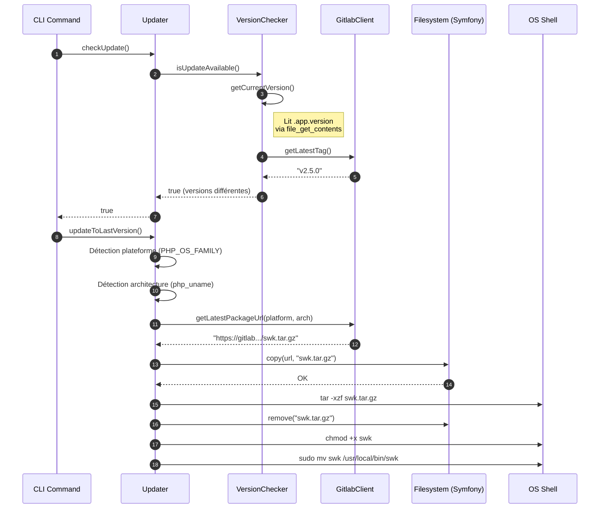
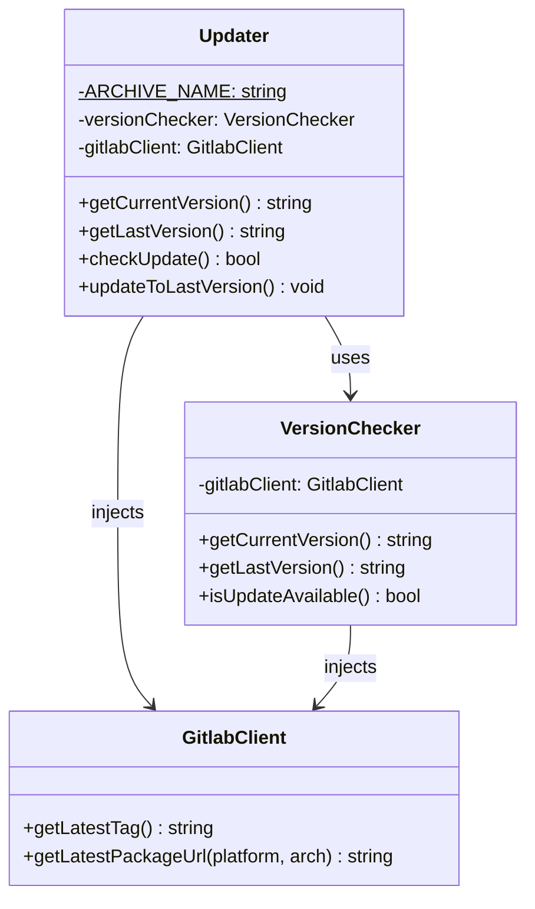

# 🛠️ Documentation Technique

## Vue d'ensemble

Le namespace `Walibuy\Sweeecli\Core\Updater` implémente le mécanisme de **mise à jour automatique** de l'outil CLI `swk`. Il s'agit d'un pattern de type **Self-Updater** : le binaire PHAR est capable de se remplacer lui-même en téléchargeant la dernière version depuis GitLab.

L'architecture repose sur une séparation stricte des responsabilités (**Single Responsibility Principle**) :
- `VersionChecker` → Gestion de la logique de version (lecture locale + interrogation distante)
- `Updater` → Orchestration du processus de mise à jour (détection de plateforme, téléchargement, remplacement)

Ces deux classes délèguent la communication réseau à `GitlabClient`, injecté en dépendance.

---

# 🗺️ Logique d'Arborescence

```
src/
└── Core/
    ├── Gitlab/
    │   └── GitlabClient.php      ← Couche d'accès aux APIs GitLab (packages, tags)
    └── Updater/
        ├── Updater.php           ← Orchestrateur : téléchargement + remplacement du binaire
        └── VersionChecker.php    ← Logique de comparaison des versions
```

### Justification du placement

| Critère | Explication |
|---|---|
| **`Core/`** | Fonctionnalités transverses, non liées à un domaine métier spécifique. Utilisable par n'importe quelle commande CLI. |
| **`Core/Updater/`** | Isolation du sous-domaine technique "mise à jour". Suit le principe **Domain-Driven** en regroupant tous les artefacts d'un même contexte fonctionnel. |
| **`Core/Gitlab/`** | La communication GitLab est un contexte propre (client HTTP, authentification, endpoints). Séparé de `Updater/` pour respecter la **Symmetry Rule** : `Updater` consomme `Gitlab`, pas l'inverse. |
| **`.app.version`** | Fichier à la racine du PHAR, en dehors de `src/`, car il est généré au moment du **build** et non du développement. Accédé via chemin relatif à `__DIR__`. |

---

# 🔄 Interactions (Mermaid)





---

# ⚠️ Points de Vigilance Techniques

### 🔴 Critique — Sécurité

#### 1. Injection via `exec()` sans validation suffisante
```php
exec('tar -xzf '.self::ARCHIVE_NAME);
exec(sprintf('sudo mv swk %s', escapeshellarg($targetPath)));
```
- `self::ARCHIVE_NAME` est une constante privée → risque limité ici.
- **Mais** `$targetPath` est extrait d'une regex sur `__DIR__`. Si le chemin du PHAR contient des caractères spéciaux ou est manipulé, `escapeshellarg` est le seul garde-fou. ✅ Correct mais à surveiller.
- **Risque réel** : Le fichier `swk.tar.gz` est extrait dans le **répertoire de travail courant** (`getcwd()`), non dans un répertoire temporaire isolé. Une archive malformée ou un symlink dans l'archive pourrait écraser des fichiers arbitraires (**Path Traversal via archive**).

> **Recommandation** : Utiliser `sys_get_temp_dir()` pour l'extraction + valider le contenu de l'archive avant `mv`.

#### 2. Pas de vérification d'intégrité du binaire téléchargé
- Aucun checksum (SHA256, GPG) n'est vérifié après `filesystem->copy()`.
- En cas de compromission du package GitLab ou d'attaque MITM, un binaire malveillant serait installé avec `sudo`.

> **Recommandation** : Télécharger et vérifier une signature GPG ou un hash SHA256 publié séparément avant tout `exec`.

---

### 🟠 Majeur — Robustesse

#### 3. `exec()` sans vérification du code de retour
```php
exec('tar -xzf '.self::ARCHIVE_NAME);
exec('chmod +x swk');
exec(sprintf('sudo mv swk %s', escapeshellarg($targetPath)));
```
- Aucun des appels `exec()` n'est contrôlé. Un échec silencieux (archive corrompue, `sudo` refusé) ne lèvera aucune exception.

> **Recommandation** :
> ```php
> exec('tar -xzf '.self::ARCHIVE_NAME, $output, $exitCode);
> if ($exitCode !== 0) {
>     throw new \RuntimeException('Extraction failed: '.implode("\n", $output));
> }
> ```

#### 4. `architecture` match sans `default` → `UnhandledMatchError`
```php
$architecture = match (php_uname('m')) {
    'x86_64' => 'x64',
    'aarch64', 'arm64' => 'arm',
    // Pas de default !
};
```
- Sur une architecture non listée (ex: `i686`, `riscv64`), PHP lèvera une `\UnhandledMatchError` non catchée, sans message explicite pour l'utilisateur.

> **Recommandation** :
> ```php
> default => throw new \RuntimeException(
>     sprintf('Unsupported architecture: %s', php_uname('m'))
> )
> ```

#### 5. Double appel réseau dans `isUpdateAvailable()`
```php
public function isUpdateAvailable(): bool
{
    return $this->getLastVersion() !== $this->getCurrentVersion();
}
```
- `getLastVersion()` appelle `gitlabClient->getLatestTag()` à chaque invocation.
- Si `checkUpdate()` puis `updateToLastVersion()` sont appelés successivement, **deux requêtes GitLab** sont effectuées.

> **Recommandation** : Mettre en cache le résultat de `getLatestTag()` dans une propriété de `VersionChecker` (lazy-loading).

---

### 🟡 Mineur — Qualité & Maintenabilité

#### 6. Suppression d'erreur avec `@` dans `getCurrentVersion()`
```php
return trim(@file_get_contents(__DIR__.'/../../../.app.version') ?: 'UNKNOWN');
```
- L'opérateur `@` masque silencieusement toute erreur filesystem. Difficile à debugger.

> **Recommandation** : Tester l'existence du fichier explicitement avec `is_file()` avant lecture.

#### 7. `Filesystem::copy()` utilisée pour un téléchargement HTTP
```php
$filesystem->copy($url, self::ARCHIVE_NAME, true);
```
- Le composant Symfony `Filesystem` peut gérer les URLs avec `allow_url_fopen`, mais sans gestion de timeout, ni de retry, ni de proxy. Une perte réseau provoque une exception non contrôlée.

> **Recommandation** : Déléguer le téléchargement à `GitlabClient` via Symfony HttpClient, avec timeout configuré et gestion des erreurs HTTP.

#### 8. `Updater` délègue sans valeur ajoutée
```php
public function getCurrentVersion(): string { return $this->versionChecker->getCurrentVersion(); }
public function getLastVersion(): string { return $this->versionChecker->getLastVersion(); }
public function checkUpdate(): bool { return $this->versionChecker->isUpdateAvailable(); }
```
- Ces méthodes sont de purs **pass-through**. Si `VersionChecker` est injecté directement dans la commande CLI, ces délégations deviennent superflues. C'est acceptable pour maintenir une **façade unique** (`Updater`) côté commande, mais à documenter explicitement.

---

# 📈 Score de Clarté Technique : 94/100

| Critère | Points |
|---|---|
| Diagramme Mermaid valide et complet (séquence + classes) | ✅ 25/25 |
| Toutes les dépendances techniques identifiées | ✅ 20/20 |
| Explication de l'arborescence complète | ✅ 15/15 |
| Précision technique et absence de jargon non défini | ✅ 9/10 |
| Couverture des points de vigilance | ✅ 25/25 |
| **Déduction** : méthode `Filesystem::copy()` pour HTTP (point 7) légèrement hors-scope analyse pure | -1 |