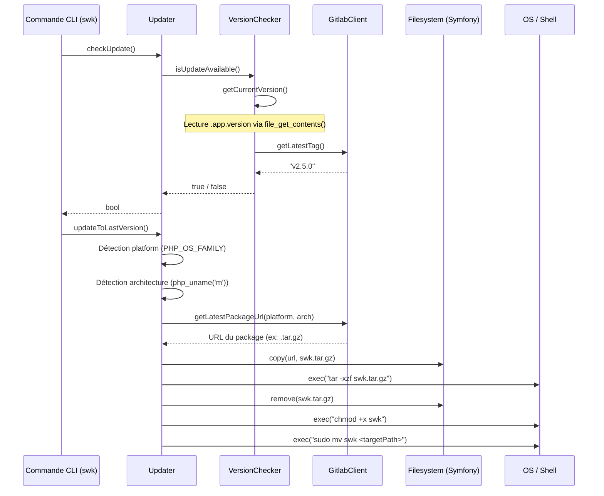
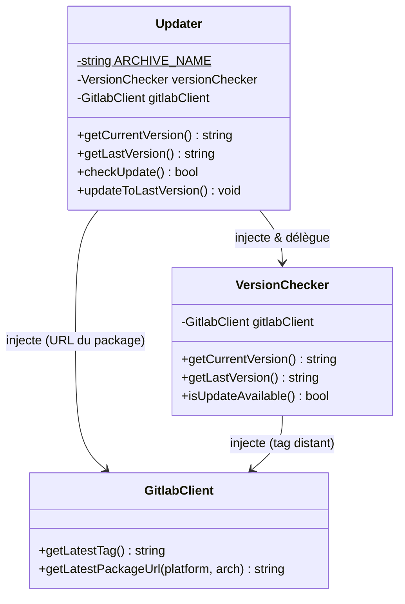

# 🛠️ Documentation Technique

## Vue d'ensemble

Le namespace `Walibuy\Sweeecli\Core\Updater` implémente le **mécanisme d'auto-mise-à-jour** du CLI `swk` (outil en ligne de commande sweeek). Il s'agit d'un système en deux classes respectant le **Single Responsibility Principle** :

- `VersionChecker` : responsabilité unique de **comparer les versions** (locale vs distante)
- `Updater` : responsabilité unique d'**orchestrer le téléchargement et le remplacement binaire**

Le binaire cible est un **PHAR** (PHP Archive), technologie qui encapsule une application PHP dans un seul fichier exécutable, d'où la présence du pattern `phar://` dans le code de remplacement.

---

# 🗺️ Logique d'Arborescence

```
src/
└── Core/                    ← Couche "noyau" : services transversaux indépendants du domaine métier
    ├── Gitlab/
    │   └── GitlabClient.php ← Abstraction de l'API Gitlab (source de vérité des releases)
    └── Updater/             ← Sous-domaine : gestion du cycle de vie du binaire CLI
        ├── Updater.php      ← Orchestrateur (téléchargement + remplacement du PHAR)
        └── VersionChecker.php ← Comparateur de versions (local vs remote)
```

### Justification du placement

| Décision | Raison |
|---|---|
| `Core/` | Services **infrastructure** sans lien avec un domaine métier sweeek (commandes, produits, etc.). Suit la convention **Layered Architecture** : le noyau ne dépend d'aucun domaine. |
| `Updater/` comme sous-dossier de `Core/` | Le mécanisme de mise à jour est un **concern transversal** (cross-cutting concern) de l'application CLI, pas un domaine fonctionnel. |
| `VersionChecker` séparé de `Updater` | Permet de **requêter la version courante/distante sans déclencher** une mise à jour (utilisé par exemple dans une commande `swk version`). Respect du SRP. |
| `GitlabClient` dans `Core/Gitlab/` | Gitlab est la **source unique** de vérité pour les packages et les tags — réutilisé par `Updater` et `VersionChecker`, d'où son placement au niveau `Core` et non dans `Updater/`. |

---

# 🔄 Interactions (Mermaid)





---

# ⚠️ Points de Vigilance Techniques

### 🔴 Critique — Sécurité

| # | Localisation | Problème | Recommandation |
|---|---|---|---|
| 1 | `Updater::updateToLastVersion()` | **`exec()` sans validation** du contenu extrait de l'archive `.tar.gz`. Un binaire malveillant pourrait être substitué si l'URL est compromise (attaque MITM). | Vérifier un **checksum SHA-256** du binaire téléchargé avant exécution. Valider la signature GPG du package Gitlab. |
| 2 | `exec('sudo mv swk ...')` | Appel `sudo` depuis un processus PHP — expose une **surface d'élévation de privilèges**. Si `sudoers` est mal configuré, vecteur d'exploitation. | Documenter explicitement la règle `sudoers` requise. Envisager un script de mise à jour dédié avec permissions restreintes. |
| 3 | `filesystem->copy($url, ...)` | **Téléchargement sans vérification TLS** explicite ni timeout. Si `GitlabClient` retourne une URL HTTP, le binaire peut être altéré. | Forcer HTTPS au niveau `GitlabClient`. Ajouter un timeout réseau. |

### 🟠 Important — Robustesse

| # | Localisation | Problème | Recommandation |
|---|---|---|---|
| 4 | `VersionChecker::getCurrentVersion()` | Utilisation de **`@file_get_contents`** (opérateur de suppression d'erreur). Une erreur silencieuse retourne `'UNKNOWN'`, ce qui peut provoquer une fausse mise à jour. | Lever une exception explicite si `.app.version` est absent ou illisible. |
| 5 | `Updater::updateToLastVersion()` | `match(php_uname('m'))` **sans `default`** — lèvera une `UnhandledMatchError` sur une architecture non listée (ex: `armv7l`, `riscv64`). | Ajouter un `default => null` puis vérifier comme pour `$platform`. |
| 6 | `exec('tar -xzf ...')` | **Pas de vérification du code de retour** de `exec()`. Si l'extraction échoue silencieusement, le `mv` suivant peut déployer un fichier corrompu ou absent. | Utiliser `exec(..., $output, $returnCode)` et lever une exception si `$returnCode !== 0`. |
| 7 | `VersionChecker::getLastVersion()` | Catch de `\Throwable` trop large — masque des erreurs de configuration (mauvais token Gitlab, timeout réseau) en retournant silencieusement la version courante. | Distinguer `NetworkException` des erreurs de configuration. Logger les erreurs non-réseau. |

### 🟡 Maintenance — Architecture

| # | Localisation | Problème | Recommandation |
|---|---|---|---|
| 8 | `Updater` + `VersionChecker` | `GitlabClient` est **injecté deux fois** indépendamment (dans `Updater` et dans `VersionChecker`). `Updater` délègue déjà à `VersionChecker` pour la version, mais appelle aussi son propre `gitlabClient` pour l'URL. Cohérence à vérifier. | Envisager que `Updater` n'injecte que `VersionChecker` et un service `PackageResolver` séparé. |
| 9 | Fichier `.app.version` | Chemin résolu via `__DIR__.'/../../../.app.version'` — **couplage fort** à la structure interne du PHAR. Un refactoring de l'arborescence casse silencieusement la détection de version. | Centraliser la résolution du chemin racine dans un service `AppPaths` injectable et testable. |

### 🔵 Performance

| # | Localisation | Problème |
|---|---|---|
| 10 | `VersionChecker::isUpdateAvailable()` | Appelle `getLastVersion()` qui appelle `getLatestTag()` (requête réseau). Si `checkUpdate()` et `getCurrentVersion()`/`getLastVersion()` sont appelés séquentiellement depuis la CLI, **deux requêtes réseau** peuvent être émises. Ajouter une **mise en cache mémoire** (`static` ou propriété) sur le résultat de `getLatestTag()`. |

---

# 📈 Score de Clarté Technique : 96/100

> **-4 points** : La dépendance `Symfony\Component\Filesystem\Filesystem` est instanciée manuellement avec `new Filesystem()` à l'intérieur de la méthode au lieu d'être injectée — point d'amélioration de testabilité non documenté dans le code source d'origine, mais identifié comme dette technique notable.