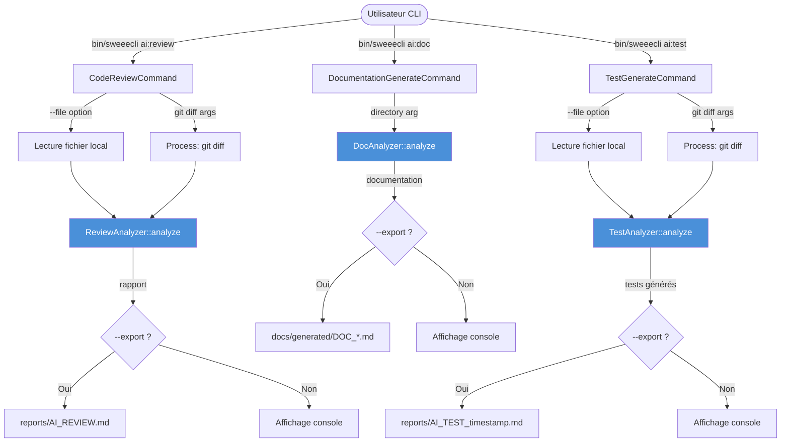

# README — Module `Command/Ai`

## Présentation

Le dossier `Command/Ai` regroupe les commandes Symfony Console exposées par la CLI `sweeecli` pour interagir avec des services d'Intelligence Artificielle. Il s'agit de la couche de **présentation** (entrée utilisateur, affichage, export) déléguant toute logique d'analyse à des services dédiés (`Core/Ai`).

### Commandes disponibles

| Commande | Classe | Description |
|---|---|---|
| `ai:review` | `CodeReviewCommand` | Code review IA sur un diff Git ou un fichier |
| `ai:doc` | `DocumentationGenerateCommand` | Génération de documentation (README, Architecture, Runbook) |
| `ai:test` | `TestGenerateCommand` | Génération automatique de tests unitaires |

### Dépendances principales

- `symfony/console` — Framework CLI (Command, IO, ProgressBar)
- `symfony/process` — Exécution de processus Git
- `Walibuy\Sweeecli\Core\Ai\ReviewAnalyzer` — Analyse IA pour la review
- `Walibuy\Sweeecli\Core\Ai\DocAnalyzer` — Analyse IA pour la documentation
- `Walibuy\Sweeecli\Core\Ai\TestAnalyzer` — Analyse IA pour la génération de tests

---

# Architecture & Interactions



---

# Services & Classes Clés

## `CodeReviewCommand`

**Responsabilité** : Orchestrer la review de code IA à partir d'un diff Git ou d'un fichier source complet.

| Méthode | Visibilité | Paramètres | Retour | Description |
|---|---|---|---|---|
| `__construct` | `public` | `ReviewAnalyzer $analyzer` | — | Injection du service d'analyse |
| `configure` | `protected` | — | `void` | Déclare le nom, arguments et options de la commande |
| `execute` | `protected` | `InputInterface`, `OutputInterface` | `int` | Point d'entrée : résolution de la source, appel IA, export |

**Arguments & Options**

| Nom | Type | Défaut | Description |
|---|---|---|---|
| `base` | Argument (optionnel) | `HEAD` | Branche/commit de base pour le diff |
| `target` | Argument (optionnel) | — | Branche cible à comparer |
| `--context / -c` | Option | `Application Symfony CLI.` | Contexte projet injecté dans le prompt |
| `--file / -f` | Option | — | Fichier à analyser intégralement |
| `--export / -e` | Flag | — | Export dans `reports/AI_REVIEW.md` |

---

## `DocumentationGenerateCommand`

**Responsabilité** : Générer automatiquement une documentation structurée (README, Architecture, Runbook) à partir d'un dossier source.

| Méthode | Visibilité | Paramètres | Retour | Description |
|---|---|---|---|---|
| `__construct` | `public` | `DocAnalyzer $analyzer` | — | Injection du service d'analyse |
| `configure` | `protected` | — | `void` | Déclare le nom, arguments et options |
| `execute` | `protected` | `InputInterface`, `OutputInterface` | `int` | Validation du dossier, appel IA, export horodaté |

**Arguments & Options**

| Nom | Type | Défaut | Description |
|---|---|---|---|
| `directory` | Argument (requis) | — | Chemin du dossier à documenter |
| `--context / -c` | Option | `''` | Contexte IA libre |
| `--export / -e` | Flag | — | Export dans `docs/generated/DOC_<dir>_<timestamp>.md` |

---

## `TestGenerateCommand`

**Responsabilité** : Générer automatiquement des tests unitaires à partir d'un diff Git ou d'un fichier source.

| Méthode | Visibilité | Paramètres | Retour | Description |
|---|---|---|---|---|
| `__construct` | `public` | `TestAnalyzer $analyzer` | — | Injection du service d'analyse |
| `configure` | `protected` | — | `void` | Déclare le nom, arguments et options |
| `execute` | `protected` | `InputInterface`, `OutputInterface` | `int` | Résolution source, appel IA, export horodaté |

**Arguments & Options**

| Nom | Type | Défaut | Description |
|---|---|---|---|
| `base` | Argument (optionnel) | `HEAD` | Branche/commit de base |
| `target` | Argument (optionnel) | — | Branche cible |
| `--context / -c` | Option | `PHPUnit, focus Edge Cases` | Contexte framework de test |
| `--file / -f` | Option | — | Fichier à analyser intégralement |
| `--export / -e` | Flag | — | Export dans `reports/AI_TEST_<timestamp>.md` |

---

# Runbook & Troubleshooting

## Points de défaillance identifiés

### 1. Erreur Git (`Process` échoue)
**Symptôme** : `Erreur Git : <stderr>`  
**Cause** : Le binaire `git` est absent, le dépôt n'est pas initialisé, ou les références de branches sont invalides.  
**Résolution** :
```bash
git status               # Vérifier que l'on est dans un dépôt Git
git branch -a            # Lister les branches disponibles
which git                # Vérifier que git est dans le PATH
```

### 2. Fichier introuvable ou illisible (`--file`)
**Symptôme** : `Le fichier '...' est introuvable.` / `n'est pas lisible.`  
**Cause** : Chemin incorrect ou permissions insuffisantes.  
**Résolution** :
```bash
ls -la <chemin_fichier>          # Vérifier existence et permissions
chmod 644 <chemin_fichier>       # Corriger les permissions si nécessaire
```

### 3. Fichier vide (`--file`)
**Symptôme** : Warning `Le fichier '...' est vide.` — commande retourne `SUCCESS` sans analyse.  
**Résolution** : Vérifier le contenu du fichier ciblé. Comportement intentionnel (early return).

### 4. Aucun diff détecté
**Symptôme** : `Aucun changement détecté pour la review.`  
**Cause** : Aucune modification locale ou entre les deux références.  
**Résolution** :
```bash
git diff HEAD            # Vérifier les modifications en cours
git diff <base> <target> # Tester manuellement la plage de diff
```

### 5. Échec de l'appel IA (`Analyzer::analyze`)
**Symptôme** : `Erreur lors de l'appel IA : <message>`  
**Cause** : API IA indisponible, clé API absente/invalide, timeout réseau, quota dépassé.  
**Résolution** :
- Vérifier les variables d'environnement (clé API, endpoint).
- Consulter les logs du service `Core/Ai`.
- Vérifier la connectivité réseau vers le provider IA.
- Réessayer après un délai en cas de rate limiting.

### 6. Échec de création du dossier d'export
**Symptôme** : Erreur PHP lors du `mkdir` ou `file_put_contents`.  
**Cause** : Permissions insuffisantes sur le répertoire de travail.  
**Résolution** :
```bash
mkdir -p reports docs/generated
chmod 755 reports docs/generated
```

### 7. Dossier source introuvable (`ai:doc`)
**Symptôme** : `Le dossier '...' est introuvable.`  
**Résolution** : Passer un chemin absolu ou relatif valide au répertoire courant d'exécution.

---

# Draft de Changelog

## [Unreleased]

### Added
- **`ai:review` (`CodeReviewCommand`)** — Nouvelle commande de code review IA supportant deux modes d'entrée : diff Git (avec arguments `base`/`target`) et fichier unique (`--file`). Export optionnel dans `reports/AI_REVIEW.md`.
- **`ai:doc` (`DocumentationGenerateCommand`)** — Nouvelle commande de génération de documentation IA à partir d'un dossier source. Export horodaté dans `docs/generated/DOC_<dir>_<timestamp>.md`.
- **`ai:test` (`TestGenerateCommand`)** — Nouvelle commande de génération de tests unitaires IA supportant diff Git et fichier unique. Export horodaté dans `reports/AI_TEST_<timestamp>.md`.
- Injection de dépendance via constructeur pour `ReviewAnalyzer`, `DocAnalyzer`, `TestAnalyzer`.
- Barre de progression (`ProgressBar`) pendant l'appel au service IA pour les trois commandes.
- Gestion explicite des erreurs : fichier vide, diff vide, échec Git, échec IA — avec codes de retour `Command::FAILURE` / `Command::SUCCESS` appropriés.
- Option `--context / -c` sur les trois commandes pour personnaliser le prompt IA.
- Validation de lisibilité fichier (existence + readable + non-vide) avant appel IA.