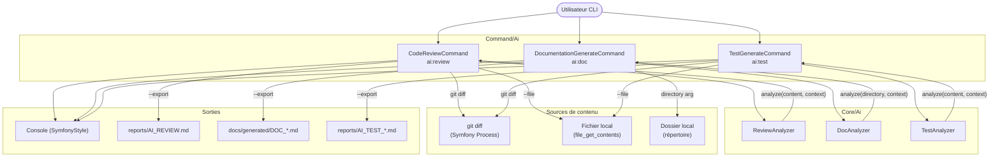

# Documentation — `Command/Ai`

---

## README Structure

### Présentation

Le dossier `Command/Ai` regroupe les commandes Symfony Console exposées par le CLI **sweeecli** (Walibuy). Ces commandes permettent d'exploiter une IA (Claude) pour automatiser trois tâches de développement :

| Commande | Nom CLI | Description |
|---|---|---|
| `CodeReviewCommand` | `ai:review` | Analyse un diff Git ou un fichier et génère un rapport de code review |
| `DocumentationGenerateCommand` | `ai:doc` | Génère une documentation Markdown (README, Architecture, Runbook) depuis un dossier |
| `TestGenerateCommand` | `ai:test` | Génère des tests automatiques (PHPUnit/Pest) depuis un diff Git ou un fichier |

### Dépendances principales

- **PHP** `^8.1` (typed properties, `declare(strict_types)`)
- **symfony/console** — Command, Input/Output, SymfonyStyle, Process
- **symfony/process** — Exécution de `git diff`
- **`Walibuy\Sweeecli\Core\Ai\ReviewAnalyzer`** — Moteur d'analyse IA (code review)
- **`Walibuy\Sweeecli\Core\Ai\DocAnalyzer`** — Moteur d'analyse IA (documentation)
- **`Walibuy\Sweeecli\Core\Ai\TestAnalyzer`** — Moteur d'analyse IA (génération de tests)

---

## Architecture & Interactions



---

## Services & Classes Clés

### `CodeReviewCommand` (`ai:review`)

**Responsabilité :** Orchestrer la récupération du contenu à analyser (fichier ou diff Git), déléguer l'analyse à `ReviewAnalyzer` et afficher/exporter le rapport.

| Élément | Détail |
|---|---|
| Argument `base` | Branche/commit de base pour `git diff` (défaut : `HEAD`) |
| Argument `target` | Branche cible à comparer (optionnel) |
| Option `--file / -f` | Analyse un fichier entier plutôt que le diff |
| Option `--context / -c` | Contexte projet transmis à l'IA |
| Option `--export / -e` | Exporte dans `reports/AI_REVIEW.md` |

**Méthode principale :**

```php
protected function execute(InputInterface $input, OutputInterface $output): int
// Retourne Command::SUCCESS (0) ou Command::FAILURE (1)
```

**Flux d'exécution :**
1. Résolution de la source (fichier ou `git diff`)
2. Validation (existence, lisibilité, contenu non vide)
3. Appel `ReviewAnalyzer::analyze(string $content, string $context): string`
4. Affichage console + export optionnel

---

### `DocumentationGenerateCommand` (`ai:doc`)

**Responsabilité :** Agréger les fichiers d'un dossier, déléguer à `DocAnalyzer` et produire une documentation Markdown.

| Élément | Détail |
|---|---|
| Argument `directory` | Chemin du dossier à documenter (**requis**) |
| Option `--context / -c` | Contexte pour guider l'IA |
| Option `--export / -e` | Exporte dans `docs/generated/DOC_<DIR>_<timestamp>.md` |

**Méthode principale :**

```php
protected function execute(InputInterface $input, OutputInterface $output): int
// Retourne Command::SUCCESS (0) ou Command::FAILURE (1)
```

**Flux d'exécution :**
1. Validation du dossier
2. Appel `DocAnalyzer::analyze(string $directory, string $context): string`
3. Affichage console + export avec nom horodaté

---

### `TestGenerateCommand` (`ai:test`)

**Responsabilité :** Générer des tests unitaires/fonctionnels depuis un diff Git ou un fichier source via `TestAnalyzer`.

| Élément | Détail |
|---|---|
| Argument `base` | Branche/commit de base (défaut : `HEAD`) |
| Argument `target` | Branche cible à comparer (optionnel) |
| Option `--file / -f` | Analyse un fichier entier |
| Option `--context / -c` | Framework et règles (défaut : PHPUnit + Edge Cases) |
| Option `--export / -e` | Exporte dans `reports/AI_TEST_<timestamp>.md` |

**Méthode principale :**

```php
protected function execute(InputInterface $input, OutputInterface $output): int
// Retourne Command::SUCCESS (0) ou Command::FAILURE (1)
```

**Flux d'exécution :**
1. Résolution de la source (fichier ou `git diff`)
2. Validation identique à `CodeReviewCommand`
3. Appel `TestAnalyzer::analyze(string $content, string $context): string`
4. Affichage console + export horodaté optionnel

---

## Runbook & Troubleshooting

### Points de défaillance identifiés

#### 1. Échec de `git diff` (Process)

**Symptôme :** Message `Erreur Git : <stderr>` — `Command::FAILURE`

**Causes possibles :**
- Le répertoire courant n'est pas un dépôt Git
- La branche/commit `base` ou `target` est inexistant
- `git` n'est pas installé ou absent du `PATH`

**Résolution :**
```bash
# Vérifier que git est accessible
git --version
# Vérifier que le dossier est un repo Git
git status
# Tester manuellement le diff
git diff HEAD
```

---

#### 2. Fichier introuvable ou illisible (`--file`)

**Symptôme :** `Le fichier '...' est introuvable.` / `n'est pas lisible.`

**Causes possibles :** Chemin relatif incorrect, permissions insuffisantes

**Résolution :**
```bash
# Vérifier le chemin depuis le répertoire de travail
ls -la <chemin_fichier>
# Corriger les permissions si nécessaire
chmod 644 <chemin_fichier>
```

---

#### 3. Aucun changement détecté (diff vide)

**Symptôme :** `Aucun changement détecté pour la review.` — `Command::SUCCESS` sans analyse

**Causes :** Aucun fichier modifié par rapport à la base spécifiée

**Résolution :** Vérifier l'état du dépôt ou préciser un `target` différent.

---

#### 4. Échec de l'appel IA (Analyzer)

**Symptôme :** `Erreur lors de l'appel IA : <message>` — `Command::FAILURE`

**Causes possibles :**
- Clé API manquante ou invalide (Claude/Anthropic)
- Timeout réseau
- Contenu trop volumineux pour le contexte du modèle

**Résolution :**
- Vérifier la configuration de la clé API dans l'environnement
- Réduire le contenu analysé (diff partiel, fichier plus petit)
- Consulter les logs du `ReviewAnalyzer` / `DocAnalyzer` / `TestAnalyzer`

---

#### 5. Échec d'export (permissions dossier)

**Symptôme :** Erreur PHP silencieuse sur `mkdir` ou `file_put_contents`

**Causes :** Permissions insuffisantes sur `reports/` ou `docs/generated/`

**Résolution :**
```bash
mkdir -p reports docs/generated
chmod 775 reports docs/generated
```

> ⚠️ Les dossiers sont créés avec `0777` — à restreindre en production.

---

## Draft de Changelog

```markdown
## [Unreleased]

### Added
- **`ai:review`** (`CodeReviewCommand`) : Nouvelle commande d'audit de code IA.
  - Support de `git diff` entre deux branches/commits.
  - Support d'analyse d'un fichier complet via `--file`.
  - Option `--export` pour générer `reports/AI_REVIEW.md`.
  - Barre de progression pendant l'appel IA.
  - Gestion des erreurs : fichier vide, illisible, diff vide, erreur Git.

- **`ai:doc`** (`DocumentationGenerateCommand`) : Génération automatique de documentation Markdown.
  - Argument `directory` requis pour cibler un dossier source.
  - Option `--export` avec nommage horodaté `DOC_<DIR>_<YmdHis>.md` dans `docs/generated/`.
  - Support d'un contexte personnalisé via `--context`.

- **`ai:test`** (`TestGenerateCommand`) : Génération automatique de tests unitaires via IA.
  - Support de `git diff` et analyse de fichier via `--file`.
  - Option `--export` avec nommage horodaté `AI_TEST_<YmdHis>.md` dans `reports/`.
  - Contexte par défaut : PHPUnit avec focus Edge Cases.

### Technical
- Injection de dépendances via constructeur pour `ReviewAnalyzer`, `DocAnalyzer`, `TestAnalyzer`.
- Utilisation de `Symfony\Component\Process` pour l'exécution de commandes Git.
- `declare(strict_types=1)` sur l'ensemble des fichiers.
```