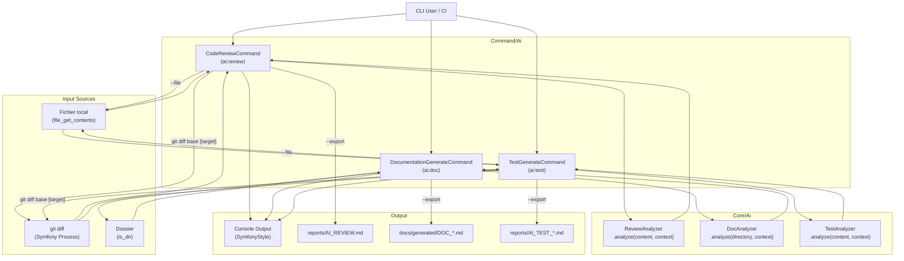

# Documentation — `Command/Ai` Module

## README Structure

### Présentation

Le dossier `Command/Ai` regroupe les **commandes CLI Symfony** exposées par le projet `sweeecli` (Walibuy). Il permet d'exploiter des analyseurs IA (Claude) pour automatiser trois tâches de développement :

| Commande | Classe | Rôle |
|---|---|---|
| `ai:review` | `CodeReviewCommand` | Revue de code sur un diff Git ou un fichier |
| `ai:doc` | `DocumentationGenerateCommand` | Génération de documentation Markdown depuis un dossier |
| `ai:test` | `TestGenerateCommand` | Génération de tests (PHPUnit/Pest) depuis un diff ou un fichier |

### Dépendances principales

- **`symfony/console`** — Framework CLI (Command, SymfonyStyle, InputArgument, InputOption)
- **`symfony/process`** — Exécution de sous-processus Git (`git diff`)
- **`Walibuy\Sweeecli\Core\Ai\ReviewAnalyzer`** — Analyseur IA pour la revue de code
- **`Walibuy\Sweeecli\Core\Ai\DocAnalyzer`** — Analyseur IA pour la documentation
- **`Walibuy\Sweeecli\Core\Ai\TestAnalyzer`** — Analyseur IA pour la génération de tests

---

## Architecture & Interactions



---

## Services & Classes Clés

### `CodeReviewCommand` — `ai:review`

**Responsabilité :** Orchestrer la revue de code IA à partir d'un diff Git ou d'un fichier source unique.

| Élément | Détail |
|---|---|
| Injecté | `ReviewAnalyzer $analyzer` |
| Commande | `ai:review [base] [target] [--context/-c] [--file/-f] [--export/-e]` |

**Arguments & Options :**

| Nom | Type | Défaut | Description |
|---|---|---|---|
| `base` | Argument optionnel | `HEAD` | Branche/commit de base du diff |
| `target` | Argument optionnel | — | Branche cible à comparer |
| `--context / -c` | Option optionnelle | `Application Symfony CLI.` | Contexte projet pour l'IA |
| `--file / -f` | Option requise (si utilisée) | — | Fichier à analyser en entier |
| `--export / -e` | Flag | `false` | Export dans `reports/AI_REVIEW.md` |

**Méthodes publiques :**

| Méthode | Retour | Description |
|---|---|---|
| `__construct(ReviewAnalyzer)` | — | Injection de l'analyseur |
| `configure()` | `void` | Déclaration des arguments/options |
| `execute(InputInterface, OutputInterface)` | `int` (`SUCCESS` / `FAILURE`) | Lecture de la source, appel IA, affichage et export optionnel |

---

### `DocumentationGenerateCommand` — `ai:doc`

**Responsabilité :** Générer automatiquement une documentation technique (README, Architecture, Runbook) à partir du contenu agrégé d'un dossier.

| Élément | Détail |
|---|---|
| Injecté | `DocAnalyzer $analyzer` |
| Commande | `ai:doc <directory> [--context/-c] [--export/-e]` |

**Arguments & Options :**

| Nom | Type | Défaut | Description |
|---|---|---|---|
| `directory` | Argument requis | — | Chemin du dossier à documenter |
| `--context / -c` | Option optionnelle | `''` | Contexte pour guider l'IA |
| `--export / -e` | Flag | `false` | Export dans `docs/generated/DOC_<DIR>_<timestamp>.md` |

**Méthodes publiques :**

| Méthode | Retour | Description |
|---|---|---|
| `__construct(DocAnalyzer)` | — | Injection de l'analyseur |
| `configure()` | `void` | Déclaration des arguments/options |
| `execute(InputInterface, OutputInterface)` | `int` (`SUCCESS` / `FAILURE`) | Validation du dossier, appel IA, affichage et export optionnel |

---

### `TestGenerateCommand` — `ai:test`

**Responsabilité :** Générer des tests unitaires/fonctionnels via l'IA à partir d'un diff Git ou d'un fichier source.

| Élément | Détail |
|---|---|
| Injecté | `TestAnalyzer $analyzer` |
| Commande | `ai:test [base] [target] [--context/-c] [--file/-f] [--export/-e]` |

**Arguments & Options :**

| Nom | Type | Défaut | Description |
|---|---|---|---|
| `base` | Argument optionnel | `HEAD` | Branche/commit de base |
| `target` | Argument optionnel | — | Branche cible |
| `--context / -c` | Option optionnelle | `PHPUnit, focus Edge Cases` | Contexte framework de test |
| `--file / -f` | Option requise (si utilisée) | — | Fichier à analyser |
| `--export / -e` | Flag | `false` | Export dans `reports/AI_TEST_<timestamp>.md` |

**Méthodes publiques :**

| Méthode | Retour | Description |
|---|---|---|
| `__construct(TestAnalyzer)` | — | Injection de l'analyseur |
| `configure()` | `void` | Déclaration des arguments/options |
| `execute(InputInterface, OutputInterface)` | `int` (`SUCCESS` / `FAILURE`) | Lecture source, appel IA, affichage et export optionnel |

---

## Runbook & Troubleshooting

### Points de défaillance identifiés

#### 1. Échec de `git diff` (commandes `ai:review`, `ai:test`)

**Symptôme :** `Erreur Git : <stderr>`

**Causes probables :**
- Git non installé ou absent du `PATH`
- Branche/commit `base` ou `target` inexistant
- Exécution hors d'un dépôt Git

**Résolution :**
```bash
git status                  # Vérifier que l'on est dans un repo Git
git branch -a               # Vérifier l'existence des branches
which git                   # Vérifier la disponibilité de Git
```

#### 2. Fichier introuvable ou illisible (`--file`)

**Symptôme :** `Le fichier '...' est introuvable.` / `n'est pas lisible.`

**Résolution :**
```bash
ls -la <chemin_fichier>     # Vérifier existence et permissions
chmod 644 <chemin_fichier>  # Corriger les permissions si nécessaire
```

#### 3. Dossier introuvable (`ai:doc`)

**Symptôme :** `Le dossier '...' est introuvable.`

**Résolution :**
```bash
ls -la <chemin_dossier>     # Vérifier l'existence du dossier
pwd                         # Vérifier le répertoire de travail courant
```

#### 4. Échec de l'appel IA (`ReviewAnalyzer`, `DocAnalyzer`, `TestAnalyzer`)

**Symptôme :** `Erreur lors de l'appel IA : <message>`

**Causes probables :**
- Clé API Claude absente ou invalide
- Timeout réseau
- Contenu trop volumineux pour le contexte du modèle

**Résolution :**
- Vérifier la configuration de la clé API (variable d'environnement ou fichier de config)
- Réduire le périmètre du diff (`--file` sur un fichier ciblé plutôt qu'un diff global)
- Vérifier la connectivité réseau vers l'API Anthropic

#### 5. Échec d'écriture du rapport (`--export`)

**Symptôme :** Erreur silencieuse ou exception PHP sur `file_put_contents` / `mkdir`

**Causes probables :**
- Permissions insuffisantes sur le répertoire courant
- Disque plein

**Résolution :**
```bash
ls -la reports/             # Vérifier les permissions du dossier reports/
df -h                       # Vérifier l'espace disque disponible
chmod 755 reports/          # Corriger si nécessaire
```

#### 6. Diff vide / fichier vide

**Symptôme :** `Aucun changement détecté` ou `Le fichier '...' est vide.`

> ⚠️ Ces cas sont gérés proprement avec `Command::SUCCESS` — ce n'est pas une erreur.

**Action :** Vérifier que des modifications sont bien présentes via `git status` ou `git diff <base>`.

---

## Draft de Changelog

```markdown
## [Unreleased]

### Added
- **`ai:review` (`CodeReviewCommand`)** : Nouvelle commande de revue de code IA.
  - Support du mode `git diff` (branche/commit base + cible optionnelle).
  - Support du mode fichier unique via `--file / -f`.
  - Option `--context / -c` pour guider l'IA avec un contexte projet.
  - Option `--export / -e` pour sauvegarder le rapport dans `reports/AI_REVIEW.md`.
  - Affichage d'une barre de progression pendant l'analyse.

- **`ai:doc` (`DocumentationGenerateCommand`)** : Nouvelle commande de génération de documentation IA.
  - Analyse récursive d'un dossier passé en argument requis.
  - Option `--context / -c` pour orienter la génération.
  - Option `--export / -e` pour sauvegarder dans `docs/generated/DOC_<DIR>_<timestamp>.md`.
  - Nommage horodaté des fichiers exportés pour éviter les collisions.

- **`ai:test` (`TestGenerateCommand`)** : Nouvelle commande de génération de tests IA.
  - Support du mode `git diff` et du mode fichier unique (`--file / -f`).
  - Contexte par défaut orienté PHPUnit avec focus sur les Edge Cases.
  - Option `--export / -e` pour sauvegarder dans `reports/AI_TEST_<timestamp>.md`.
  - Horodatage du fichier de sortie pour permettre des générations multiples.

### Internal
- Injection de dépendances via constructeurs (`ReviewAnalyzer`, `DocAnalyzer`, `TestAnalyzer`).
- Création automatique des dossiers `reports/` et `docs/generated/` à l'export si absents.
- Gestion unifiée des erreurs (fichier absent, illisible, vide, échec Git, échec IA) avec codes de retour `SUCCESS` / `FAILURE`.
```