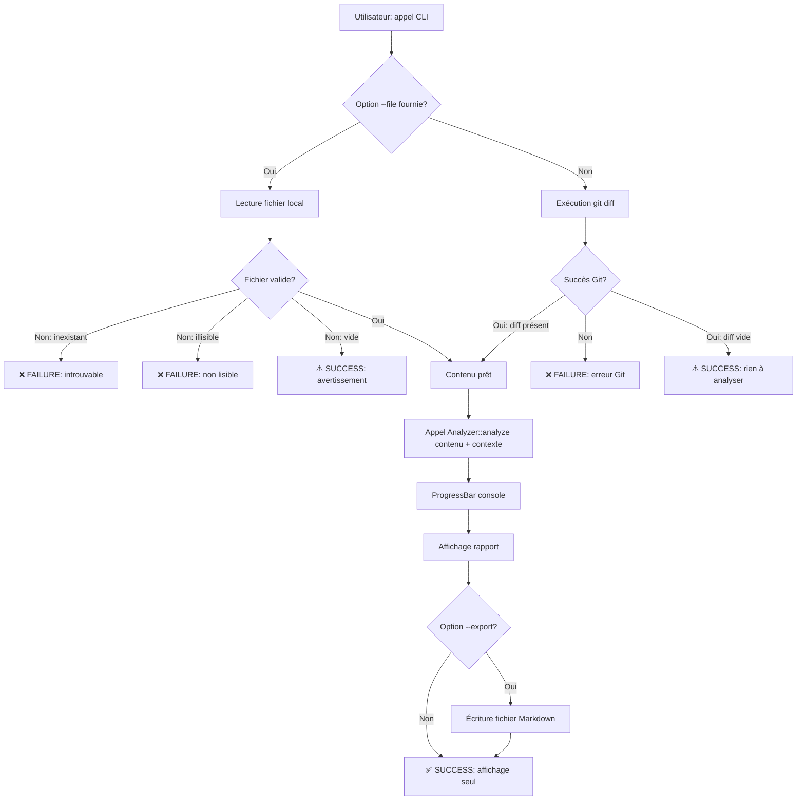
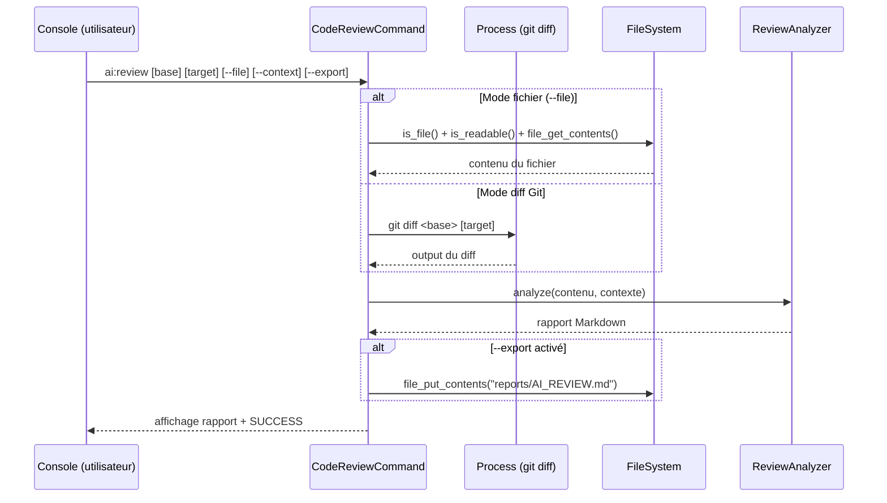
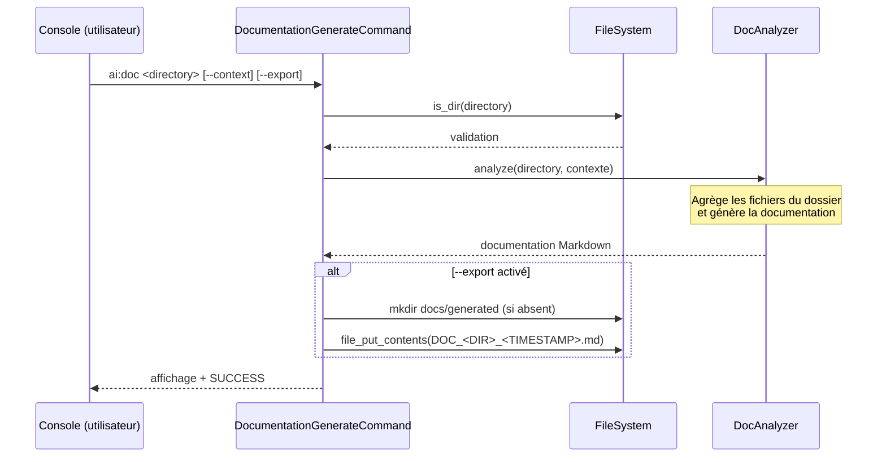
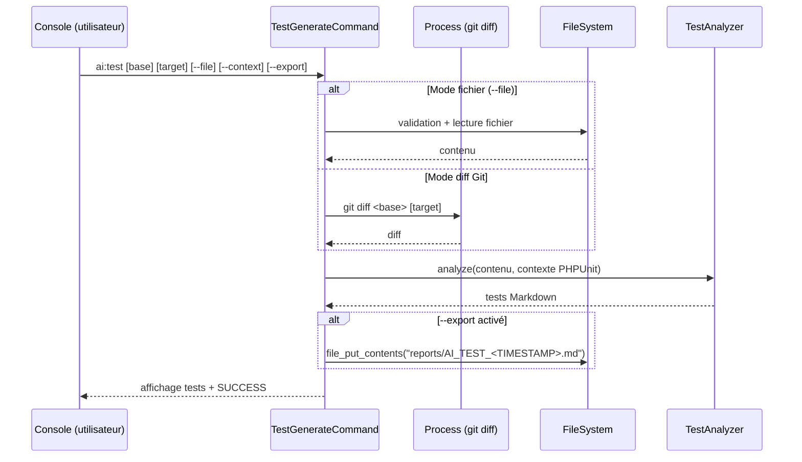

# 📘 Documentation Fonctionnelle

## Vue d'ensemble

Ce dossier regroupe **trois commandes CLI assistées par l'IA** constituant le cœur de l'outillage développeur de `sweeek`. Elles permettent à n'importe quel membre de l'équipe technique d'automatiser trois tâches chronophages directement depuis son terminal.

| Commande CLI | Fichier | Rôle métier |
|---|---|---|
| `ai:review` | `CodeReviewCommand.php` | Audit de qualité du code (diff Git ou fichier) |
| `ai:doc` | `DocumentationGenerateCommand.php` | Génération de documentation technique d'un dossier |
| `ai:test` | `TestGenerateCommand.php` | Génération automatique de tests unitaires |

---

### 🎯 `ai:review` — Audit de code par l'IA

**Objectif :** Remplacer ou compléter la revue de code humaine en soumettant un diff Git (ou un fichier entier) à l'IA de sweeek pour obtenir un rapport d'audit structuré.

**Cas d'usage typiques :**
- Avant une Pull Request : `sweeecli ai:review main feature/my-feature --export`
- Audit ponctuel d'un fichier legacy : `sweeecli ai:review --file src/Legacy/OldService.php`

**Sortie produite :** Un rapport Markdown affiché en console, exportable dans `reports/AI_REVIEW.md`.

---

### 📄 `ai:doc` — Génération de documentation

**Objectif :** Analyser le contenu d'un dossier source et produire automatiquement une documentation de type README / Architecture / Runbook.

**Cas d'usage typiques :**
- Documenter un nouveau module : `sweeecli ai:doc src/Command/Ai --export`
- Générer la doc d'un service tiers intégré avec contexte métier : `sweeecli ai:doc src/Integration --context "Module de paiement Stripe"`

**Sortie produite :** Un fichier Markdown horodaté dans `docs/generated/DOC_<DOSSIER>_<TIMESTAMP>.md`.

---

### 🧪 `ai:test` — Génération de tests

**Objectif :** À partir d'un diff Git ou d'un fichier, générer les tests unitaires correspondants (PHPUnit par défaut) avec un focus automatique sur les edge cases.

**Cas d'usage typiques :**
- Générer les tests d'un développement en cours : `sweeecli ai:test HEAD --export`
- Générer les tests d'un fichier existant non couvert : `sweeecli ai:test --file src/Service/PricingService.php --context "PHPUnit, règles de nommage snake_case"`

**Sortie produite :** Un fichier Markdown horodaté dans `reports/AI_TEST_<TIMESTAMP>.md`.

---

# 🛠️ Documentation Technique

## Arborescence et logique de rangement

```
src/
└── Command/
    └── Ai/                          ← Namespace : Walibuy\Sweeecli\Command\Ai
        ├── CodeReviewCommand.php    ← Commande ai:review
        ├── DocumentationGenerateCommand.php  ← Commande ai:doc
        └── TestGenerateCommand.php  ← Commande ai:test

src/
└── Core/
    └── Ai/                          ← Couche métier IA (analyseurs)
        ├── ReviewAnalyzer.php       ← Injecté dans CodeReviewCommand
        ├── DocAnalyzer.php          ← Injecté dans DocumentationGenerateCommand
        └── TestAnalyzer.php         ← Injecté dans TestGenerateCommand

reports/                             ← Généré à la volée (git-ignored recommandé)
│   ├── AI_REVIEW.md
│   └── AI_TEST_20250101_120000.md

docs/
└── generated/                       ← Généré à la volée (git-ignored recommandé)
    └── DOC_src_Command_Ai_20250101_120000.md
```

**Convention architecturale :** Les `Command` sont de pures **couches d'orchestration UI** (Console). Elles ne contiennent aucune logique métier IA. Celle-ci est déléguée aux `Analyzer` injectés via le constructeur (injection de dépendance Symfony).

---

## Flux d'exécution détaillé

### Flux commun aux 3 commandes



---

### Flux spécifique `ai:review` (`CodeReviewCommand`)



---

### Flux spécifique `ai:doc` (`DocumentationGenerateCommand`)



---

### Flux spécifique `ai:test` (`TestGenerateCommand`)



---

## Référence complète des commandes

### `ai:review`
| Paramètre | Type | Requis | Défaut | Description |
|---|---|---|---|---|
| `base` | Argument | Non | `HEAD` | Branche/commit de base pour le diff |
| `target` | Argument | Non | *(vide)* | Branche cible à comparer |
| `--file` / `-f` | Option | Non | *(null)* | Fichier à analyser (bypass git diff) |
| `--context` / `-c` | Option | Non | `Application Symfony CLI.` | Contexte projet pour l'IA |
| `--export` / `-e` | Option | Non | `false` | Export dans `reports/AI_REVIEW.md` |

### `ai:doc`
| Paramètre | Type | Requis | Défaut | Description |
|---|---|---|---|---|
| `directory` | Argument | **Oui** | *(n/a)* | Dossier à documenter |
| `--context` / `-c` | Option | Non | `''` | Contexte projet pour l'IA |
| `--export` / `-e` | Option | Non | `false` | Export dans `docs/generated/DOC_*.md` |

### `ai:test`
| Paramètre | Type | Requis | Défaut | Description |
|---|---|---|---|---|
| `base` | Argument | Non | `HEAD` | Branche/commit de base pour le diff |
| `target` | Argument | Non | *(vide)* | Branche cible à comparer |
| `--file` / `-f` | Option | Non | *(null)* | Fichier à analyser (bypass git diff) |
| `--context` / `-c` | Option | Non | `PHPUnit. Focus Edge Cases.` | Framework de test + conventions |
| `--export` / `-e` | Option | Non | `false` | Export dans `reports/AI_TEST_<TIMESTAMP>.md` |

---

## Codes de retour

| Code | Constante Symfony | Déclencheur |
|---|---|---|
| `0` | `Command::SUCCESS` | Exécution normale (même si fichier vide ou diff vide) |
| `1` | `Command::FAILURE` | Fichier introuvable, illisible, erreur Git, exception IA |

---

# ⚠️ Points de Vigilance (Runbook)

### 🔴 CRITIQUE — Dépendance à l'API IA (Analyzers)

**Risque :** Toutes les commandes échouent si le service IA (`ReviewAnalyzer`, `DocAnalyzer`, `TestAnalyzer`) est indisponible ou renvoie une exception.

**Comportement actuel :** Un `catch (\Exception $e)` générique intercepte toutes les erreurs et retourne `FAILURE`.

**Surveillance :** Monitorer les timeouts réseau vers l'API Claude. Envisager un timeout explicite dans les Analyzers.

**Action corrective :** Vérifier la variable d'environnement `ANTHROPIC_API_KEY` (ou équivalent) et la connectivité réseau.

---

### 🔴 CRITIQUE — Dépendance à `git` dans le `PATH`

**Risque :** `CodeReviewCommand` et `TestGenerateCommand` exécutent `git diff` via `Symfony\Component\Process`. Si `git` n'est pas dans le `PATH` de l'environnement d'exécution (Docker, CI sans git installé), les commandes échouent.

**Surveillance :** Vérifier la présence de git : `which git` dans le container/CI.

**Action corrective :**
```bash
git --version  # doit retourner une version valide
```

---

### 🟠 MAJEUR — Droits d'écriture sur les dossiers de sortie

**Risque :** `mkdir()` et `file_put_contents()` sont appelés sans gestion d'erreur explicite. Si le processus n'a pas les droits d'écriture sur `reports/` ou `docs/generated/`, l'export silently fails ou lève une `Warning` PHP non catchée.

**Recommandation :** Wrapper les appels filesystem dans des blocs try/catch ou vérifier `is_writable()` avant l'écriture.

---

### 🟠 MAJEUR — Écrasement silencieux de `AI_REVIEW.md`

**Comportement actuel :** Chaque appel à `ai:review --export` **écrase** `reports/AI_REVIEW.md` sans avertissement.

**Risque :** Perte d'une review précédente si l'utilisateur relance la commande.

**Divergence notée :** `ai:test --export` génère un fichier horodaté (`AI_TEST_<TIMESTAMP>.md`), ce qui évite l'écrasement. Ce comportement devrait être aligné sur `ai:review`.

---

### 🟡 MODÉRÉ — Contenu volumineux envoyé à l'IA

**Risque :** Un diff très large (ex: merge de plusieurs semaines) ou un fichier massif peut dépasser les limites de tokens du modèle IA, provoquant une erreur ou une réponse tronquée.

**Surveillance :** La commande affiche `Analyse du contenu (X caractères)` — surveiller les valeurs > 50 000 caractères.

**Recommandation :** Ajouter une limite configurable avec un avertissement explicite.

---

### 🟡 MODÉRÉ — Permissions `0777` sur les dossiers créés

**Comportement actuel :**
```php
mkdir($folder, 0777, true);
```
**Risque :** Permissions trop permissives en environnement de production ou partagé.

**Recommandation :** Utiliser `0755` (ou `0750` en environnement sécurisé).

---

### 🟢 MINEUR — Encodage des noms de dossiers dans `ai:doc`

**Comportement actuel :**
```php
$safeDirName = str_replace(['/', '\\'], '_', rtrim($directory, '/'));
```
Les espaces et caractères spéciaux (accents, `&`, etc.) dans les noms de dossiers ne sont pas sanitisés. Peut produire des noms de fichiers problématiques sur certains OS.

---

### Checklist de démarrage rapide

```bash
# 1. Vérifier que git est accessible
git --version

# 2. Vérifier la configuration de l'API IA
php bin/sweeecli list ai

# 3. Tester une review simple (sans export)
php bin/sweeecli ai:review HEAD

# 4. Tester la génération de doc
php bin/sweeecli ai:doc src/Command/Ai

# 5. Tester la génération de tests
php bin/sweeecli ai:test HEAD
```

---

#