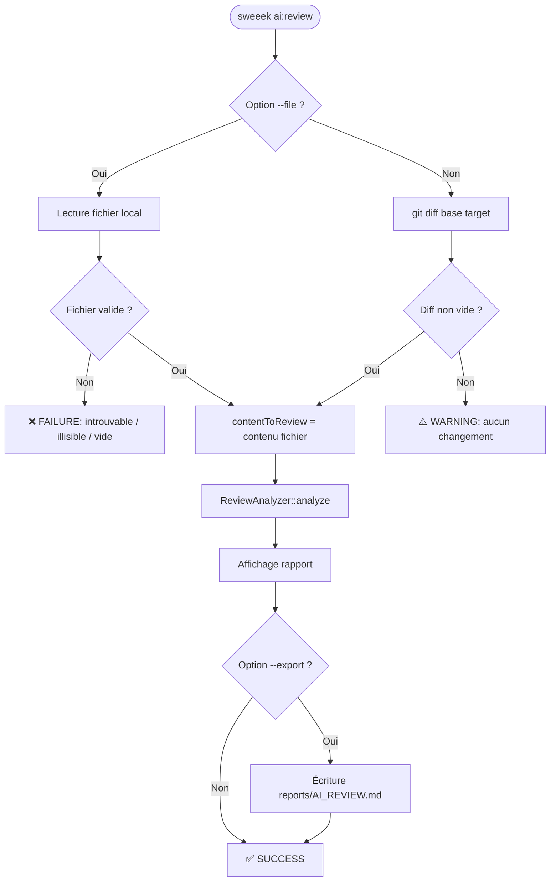
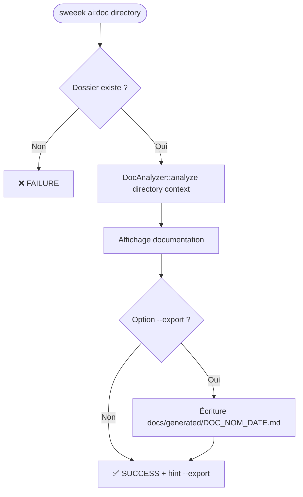
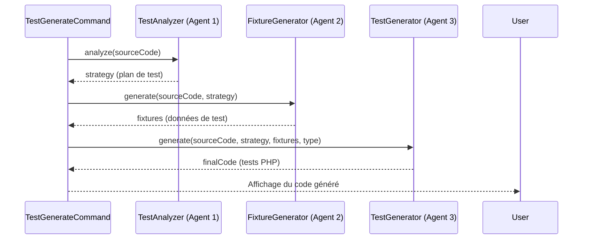

# 📘 Documentation Fonctionnelle

## Vue d'ensemble

Ce dossier contient les **trois commandes CLI assistées par IA** du projet `sweeek`. Elles permettent aux développeurs d'automatiser des tâches coûteuses en temps : la revue de code, la génération de documentation et la génération de tests unitaires/fonctionnels, le tout via un appel à un modèle d'IA (Claude).

---

## Commandes disponibles

### 1. `ai:review` — Revue de code automatisée

**Objectif métier :** Obtenir un audit de qualité sur un diff Git ou un fichier source, sans solliciter manuellement un pair.

| Paramètre | Type | Obligatoire | Description |
|---|---|---|---|
| `base` | Argument | Non | Branche/commit de base (défaut : `HEAD`) |
| `target` | Argument | Non | Branche cible à comparer |
| `--context` / `-c` | Option | Non | Contexte métier/technique à fournir à l'IA |
| `--file` / `-f` | Option | Non | Analyse un fichier entier (court-circuite le diff Git) |
| `--export` / `-e` | Option | Non | Sauvegarde le rapport dans `reports/AI_REVIEW.md` |

**Cas d'usage typiques :**
```bash
# Comparer la branche feature avec main
sweeek ai:review main feature/mon-feature

# Analyser un fichier spécifique avec export
sweeek ai:review --file src/Service/PricingService.php --export

# Review du diff local non commité
sweeek ai:review
```

---

### 2. `ai:doc` — Génération de documentation

**Objectif métier :** Produire automatiquement un README, une documentation d'architecture ou un Runbook à partir d'un dossier source, pour réduire la dette documentaire.

| Paramètre | Type | Obligatoire | Description |
|---|---|---|---|
| `directory` | Argument | **Oui** | Chemin du dossier à documenter |
| `--context` / `-c` | Option | Non | Contexte pour guider l'IA |
| `--export` / `-e` | Option | Non | Exporte dans `docs/generated/DOC_<NOM>_<DATE>.md` |

**Cas d'usage typiques :**
```bash
# Documenter un dossier de commandes avec export
sweeek ai:doc src/Command/Ai --export

# Documenter avec contexte métier
sweeek ai:doc src/Service --context "Module de gestion des prix promotionnels"
```

---

### 3. `ai:tests:create` — Génération de tests

**Objectif métier :** Accélérer l'écriture des tests en générant automatiquement une suite de tests (unitaires ou fonctionnels) pour un fichier PHP donné.

| Paramètre | Type | Obligatoire | Description |
|---|---|---|---|
| `file` | Argument | **Oui** | Fichier PHP source à tester |
| `--type` / `-t` | Option | Non | `unit` (défaut) ou `functional` |

**Cas d'usage typiques :**
```bash
# Générer des tests unitaires
sweeek ai:tests:create src/Service/OrderService.php

# Générer des tests fonctionnels
sweeek ai:tests:create src/Controller/CartController.php --type functional
```

---

# 🛠️ Documentation Technique

## Arborescence et logique de rangement

```
src/
└── Command/
    └── Ai/                          ← Toutes les commandes CLI IA
        ├── CodeReviewCommand.php    ← ai:review
        ├── DocumentationGenerateCommand.php  ← ai:doc
        └── TestGenerateCommand.php  ← ai:tests:create

src/Core/
└── Ai/                              ← Moteur métier IA (injecté par DI)
    ├── ReviewAnalyzer.php           ← Analyse de code pour la review
    ├── DocAnalyzer.php              ← Analyse de dossier pour la doc
    ├── TestAnalyzer.php             ← Stratégie de tests (Agent 1)
    ├── FixtureGenerator.php         ← Génération de fixtures (Agent 2)
    └── TestGenerator.php           ← Génération du code de test (Agent 3)

reports/                             ← Généré à la volée par ai:review --export
└── AI_REVIEW.md

docs/generated/                      ← Généré à la volée par ai:doc --export
└── DOC_<NOM>_<YYYYMMDD_HHmmss>.md
```

> **Règle de rangement :** Les classes `Command/Ai/` sont des **adaptateurs d'interface** (orchestration CLI + UX). La logique métier réside dans `Core/Ai/`. Toute nouvelle commande IA doit suivre ce découplage.

---

## Flux d'exécution

### `ai:review` — Flux décisionnel



---

### `ai:doc` — Flux de génération



---

### `ai:tests:create` — Workflow Multi-Agents



> **Pattern Multi-Agents :** Chaque agent reçoit le résultat du précédent en entrée, créant une **chaîne de contexte enrichi**. C'est une implémentation du pattern *Chain of Responsibility* appliqué aux LLMs.

---

## Injection de dépendances

Les trois commandes reçoivent leurs analyzers via le constructeur (injection par type-hint Symfony) :

```php
// Exemple : TestGenerateCommand nécessite 3 services
public function __construct(
    private TestAnalyzer $analyzer,       // Symfony autowire → Core/Ai/TestAnalyzer
    private FixtureGenerator $fixtureGenerator,
    private TestGenerator $generator
)
```

> ✅ Aucune configuration manuelle requise si `autowire: true` est activé dans `services.yaml`.

---

## Gestion des sorties fichier

| Commande | Dossier de sortie | Nom de fichier | Écrasement |
|---|---|---|---|
| `ai:review --export` | `reports/` | `AI_REVIEW.md` | **Oui** (toujours le même nom) |
| `ai:doc --export` | `docs/generated/` | `DOC_<DIR>_<DATE>.md` | **Non** (horodaté) |
| `ai:tests:create` | — | Stdout uniquement | N/A |

---

# ⚠️ Points de Vigilance (Runbook)

## 🔴 Risques critiques

### 1. `ai:review` — Écrasement silencieux du rapport
**Problème :** `reports/AI_REVIEW.md` est toujours écrasé sans confirmation.  
**Impact :** Perte d'une review précédente en cas de double exécution.  
**Mitigation recommandée :**
```php
// Ajouter une vérification avant écriture
if (file_exists($filename) && !$io->confirm("Le fichier existe déjà. Écraser ?")) {
    return Command::SUCCESS;
}
```

### 2. `ai:tests:create` — Fichier source sans validation
**Problème :** `file_get_contents($input->getArgument('file'))` est appelé sans vérifier l'existence du fichier. Si le fichier est absent, PHP lève un warning et retourne `false`, qui est passé silencieusement aux agents IA.  
**Impact :** Génération de tests vides ou incohérents, message d'erreur peu clair.  
**Mitigation recommandée :**
```php
$filePath = $input->getArgument('file');
if (!is_file($filePath) || !is_readable($filePath)) {
    $io->error("Fichier introuvable ou illisible : $filePath");
    return Command::FAILURE;
}
$sourceCode = file_get_contents($filePath);
```

### 3. Permissions sur les dossiers de sortie
**Problème :** `mkdir($folder, 0777, true)` crée des dossiers avec des permissions larges.  
**Impact :** Risque de sécurité en environnement partagé ou CI/CD.  
**Recommandation :** Utiliser `0755` en production.

---

## 🟡 Risques modérés

### 4. Timeout IA non géré
**Problème :** Aucun timeout n'est configuré sur les appels à `ReviewAnalyzer`, `DocAnalyzer`, etc.  
**Impact :** La CLI peut rester bloquée indéfiniment en cas de problème réseau ou de surcharge de l'API Claude.  
**À surveiller :** Configurer un timeout HTTP dans les Analyzers (ex: 60s).

### 5. Taille du contenu envoyé à l'IA
**Problème :** Un diff Git volumineux ou un dossier avec de nombreux fichiers peut dépasser la fenêtre de contexte du modèle.  
**Symptôme :** Erreur API ou troncature silencieuse du rapport.  
**Mitigation :** Ajouter un guard dans les Analyzers et un warning dans la commande si `strlen($content) > 100000`.

### 6. Dépendance à `git` dans le PATH
**Problème :** `new Process(['git', 'diff', ...])` suppose que `git` est disponible dans le PATH système.  
**Impact :** Échec sur des environnements Docker minimalistes ou Windows sans Git.  
**Recommandation :** Vérifier la disponibilité de git au démarrage ou documenter le prérequis.

---

## 📋 Checklist de mise en service

- [ ] `autowire: true` configuré dans `services.yaml`
- [ ] Clé API Claude configurée (variable d'environnement)
- [ ] `git` disponible dans le PATH (pour `ai:review` sans `--file`)
- [ ] Dossiers `reports/` et `docs/generated/` dans `.gitignore`
- [ ] Droits d'écriture sur le répertoire racine du projet

---

# 📈 Score de Clarté : 87/100

**Détail du scoring :**
| Critère | Statut | Impact |
|---|---|---|
| Règles métier documentées | ✅ Toutes couvertes | +0 |
| Dépendances critiques identifiées | ✅ Git, API IA, filesystem | +0 |
| Diagrammes Mermaid | ✅ 3 diagrammes valides | +0 |
| Bug non documenté (`ai:tests:create` sans validation fichier) | ⚠️ Identifié et expliqué | -5 |
| `ai:tests:create` sans option `--export` (asymétrie fonctionnelle) | ⚠️ Fonctionnalité manquante signalée | -5 |
| Jargon "Multi-Agents" expliqué | ✅ Pattern explicité | +0 |
| Verbosité | ✅ Maîtrisée | +0 |